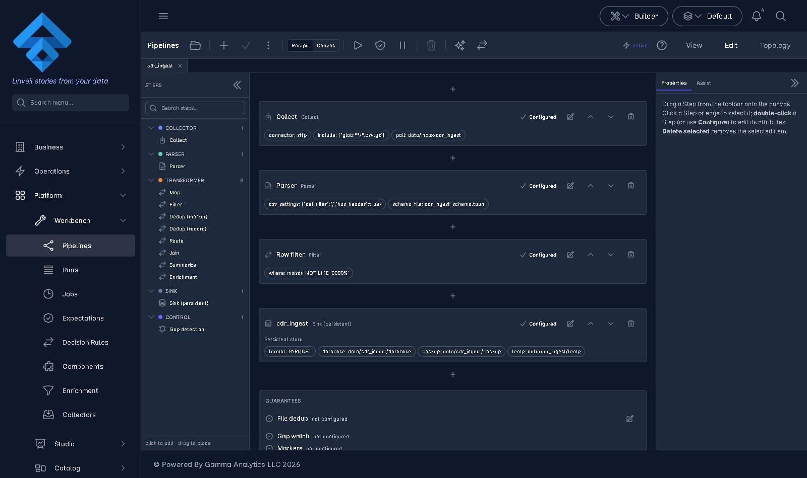
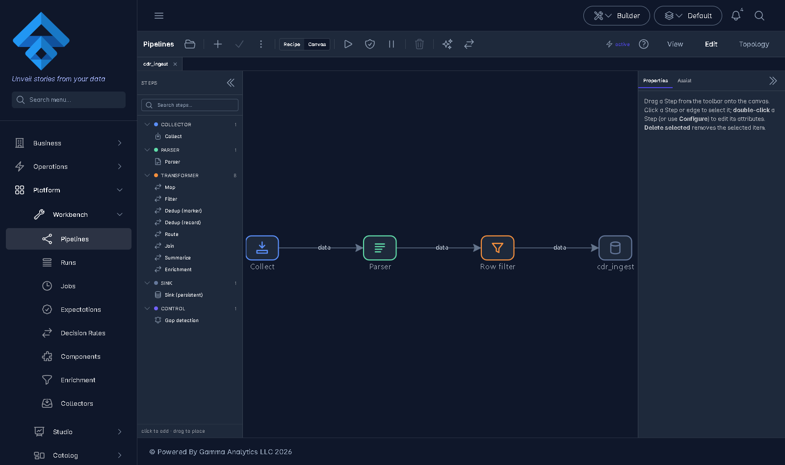
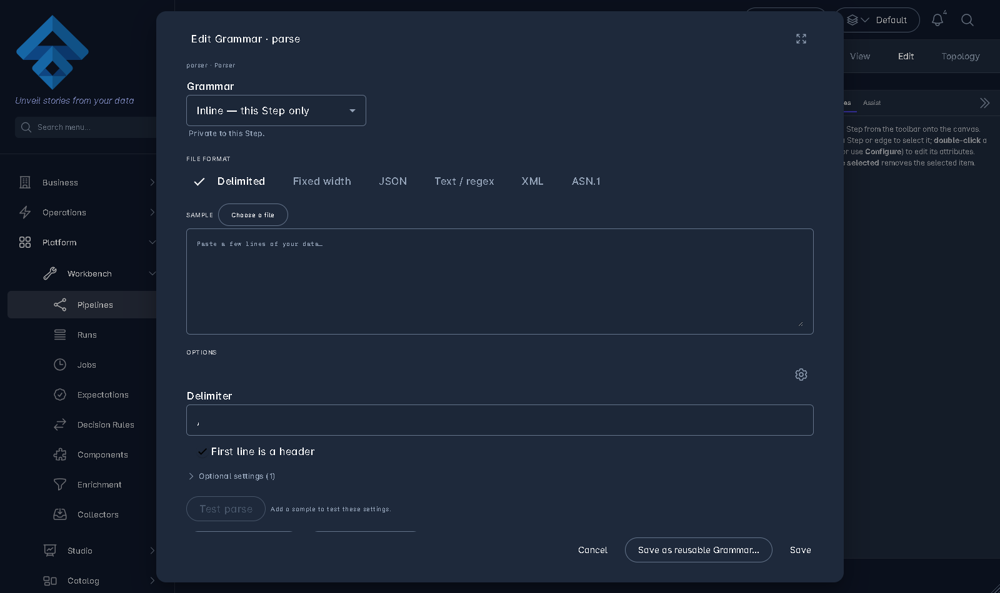
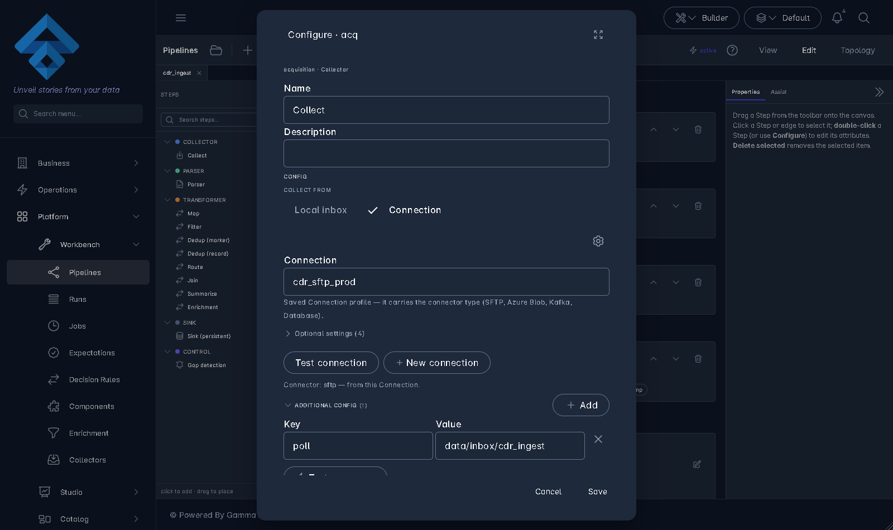
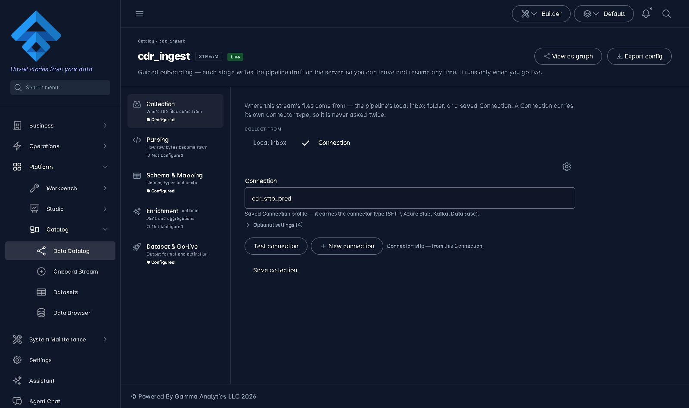
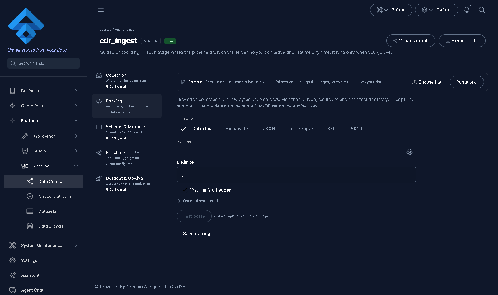
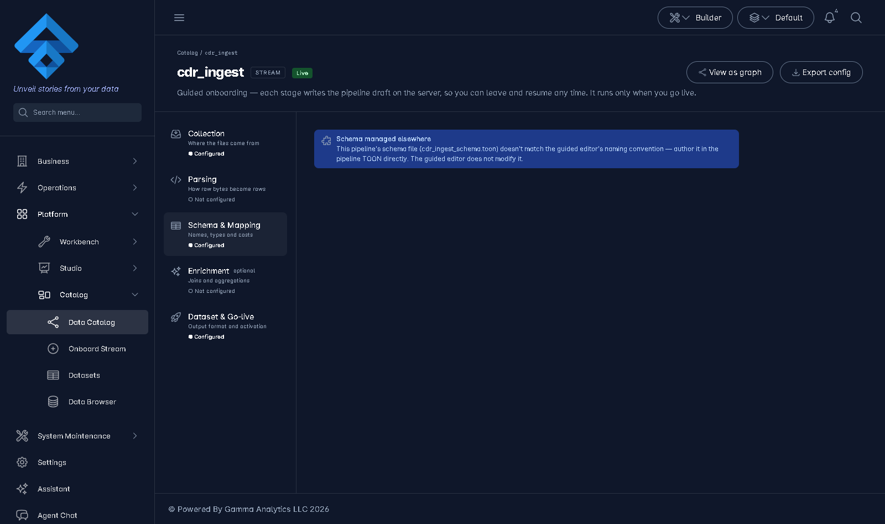
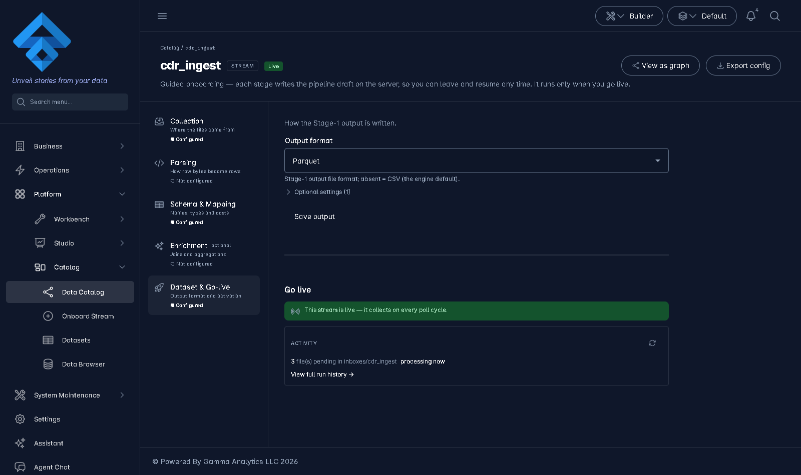

# Definition-Surface Unification — ONE way to define a pipeline

**Status: ACCEPTED — P0 complete 2026-08-13 (all §11 questions resolved by operator).** Owner: UI + engine. Created 2026-08-13.

---

## 1. Problem & intent

Today the same objects (collection, parser/grammar, schema, enrichment, output) are definable in
**two hosts** with different look-and-feel, parameters, and save semantics:

- `/catalog/onboard/<name>/<stage>` — wizard panes, immediate per-block `POST /config/patch`.
- `/pipelines` editor — MatDialog node dialogs, in-memory patch + deferred whole-graph `PUT`.

The earlier unification (W0–W5, archived: `docs/archived-documents/plans-archive/onboarding-pipeline-unification.md`)
deliberately unified only the **inner editors** (`<inspecto-collector-config>`, `<inspecto-grammar-editor>`,
`<inspecto-enrichment-editor>`, `<inspecto-schema-form>`, shared `AttributeSpec` tables) and kept two hosts
because the persisted shapes differ. **This plan reverses that host decision**: the onboarding wizard was
built for the Stage-1 engine only (it authors 5 of the 12 lowerable node types — confirmed
`docs/okf/frontend/features/onboarding.md:4`, `onboarding-state.service.ts:37-52`), the pipeline editor is a
superset, so the editor becomes the **single definition surface** and the wizard is retired into a guided
mode over it.

**Target user capability** (the bar every slice is measured against):

> Define a complex grammar (properties **and** plugin file), create a schema and its mapping as properties
> *synchronized* from the parse result, see the live table and test at every step, and use SQL to select /
> verify while mapping — all in one place, one visual language, one save model.

## 2. Binding decisions proposed (discuss, then pin)

| # | Decision | Consequence |
|---|----------|-------------|
| **D1** | **One host: the `/pipelines` editor.** Node dialogs are replaced by *definition drawers*; the onboarding wizard route becomes a guided checklist over the same editor, then a redirect. | Reverses W5's "two hosts" decision — record the reversal in the OKF when shipped. |
| **D2** | **One save semantics: deferred.** Drawers are pure (`@Input` value / `@Output` change); the editor owns persistence — whole-graph `PUT` plus ordered *companion write-adapters* (schema file, enrichment config, segment schemas) executed by the host at Save time. | Kills the two-writers hazard (`collector-config.md:58`) instead of importing it. Panes stop injecting `OnboardingStateService`. |
| **D3** | **File dedup is Collection properties, not a node.** `collector.duplicate.*` (already in `COLLECTOR_ATTRIBUTES`) + marker-file dedup (`processing.duplicate_check.*`) fold into the Collection drawer as an "Already-seen files" property group. `transform.dedup.marker` leaves the palette. | Needs the strict-lower fix in §8-H1 first, or graph saves silently delete marker dedup. **Record dedup (`transform.dedup`) is untouched — it stays a Stage-2 node** per the 2026-08-11 decision. |
| **D4** | **Schema & mapping are *sync properties* of the parser output.** One derivation chain, server-side: parse preview → `POST /config/suggest/schema` → editable field/mapping grid → cast preview. The client-side `suggestTypes()` fork in the onboarding pane is retired. | One inference implementation (`SchemaSuggest.infer`), and mapping rules come with it for free (`ConfigRoutes.java:576-580`). |
| **D5** | **Sample is editor-level state**, not wizard state. A `DefinitionStateService` scoped to the editor tab holds `sample / parsePreview / schemaPreview`, so every drawer tests against the same thread. | Replaces `OnboardingStateService`'s preview slots; stage rail/lifecycle logic is NOT carried over. |

## 3. What already exists (grounded — build on it, don't rebuild)

- **Shared inner editors + spec tables** — both surfaces already render collector/parser/enrichment/output
  through the same components and `COLLECTOR_ATTRIBUTES`/`OUTPUT_ATTRIBUTES`; pipelines additionally honours
  **server-published** specs from `GET /pipelines/node-types` (`node-config.dialog.ts:47-56`). The unified
  drawers must keep the server-published path (onboarding's client-only `stageAttributesFor()` is the
  regression to avoid).
- **Query-over-sample already works**: the parsed table is `<inspecto-data-table tier="pro" sourceName="parsed">`
  — seeded `SELECT * FROM "parsed"`, client-side AlaSQL run + `(runOnServer)` hook (`data-table.component.ts:49-59`).
- **Server SQL**: `POST /db/query` (SqlGuard-checked, sandboxed, store registered as a view —
  `DbBrowserRoutes.java:142-200`).
- **Preview endpoints**: parsing (`POST /config/preview/parsing`), schema cast (`POST /config/preview/schema`),
  suggest (`POST /config/suggest/schema`), enrichment (`POST /enrichment/preview`), plugin parser
  (`POST /parsers/{id}/preview`), dry-run per-node counts (`POST /pipelines/authored/{id}/dry-run`, accepts a
  candidate graph so unsaved edits test fine), `sink.view` data (`GET /views/{name}/data`).
- **Drawer precedent**: the app's only true slide-over is `dashboard-drill-drawer.component.ts` (fixed right,
  `role="dialog"`); the editor's docks use `[inspectoSplit]`. There is **no shared drawer primitive yet** —
  this plan introduces one into the design system.

## 3b. The two surfaces today (screenshots, mock mode, pipeline `cdr_ingest`)

Captured 2026-08-13 from the offline dev server (`ng serve -c offline`, 1600×950). They make the split
visible: the *forms* are identical (shared inner editors), only the hosts and save affordances differ.

**Pipelines editor** — Recipe mode (step cards + Guarantees panel; note "File dedup — not configured"
is a *third* place dedup surfaces today) and Canvas mode (palette carries both `Dedup (marker)` and
`Dedup (record)` nodes):




**Pipeline dialogs** — grammar ("Edit Grammar · parse") and collector ("Configure · acq"; the collapsed
"Additional config" key/value escape hatch — where `poll` lives — has no pane equivalent):




**Onboarding wizard** — same collector/grammar forms rendered full-page with per-block Save buttons and
the stage rail. The Schema & Mapping shot caught a live instance of hazard §9-2: the `foreignManaged`
lock ("Schema managed elsewhere") fired because `cdr_ingest_schema.toon` doesn't match the guided
editor's convention path — exactly what the unified schema pane must eliminate:






Extra observation for D3: dedup currently shows up in **three** visual places (collector properties,
two palette nodes, the Guarantees row) — the plan should also state how the Guarantees "File dedup"
row maps onto the folded Collection-drawer group.

## 4. Component inventory (names + responsibility)

| Component | New/refactor | Responsibility |
|---|---|---|
| `<inspecto-definition-drawer>` | **new** (design system) | Shared right slide-over shell: title, kind icon, dirty badge, Apply/Discard footer, `guardDirtyClose`, resize grip, a11y (`role="dialog"`, focus trap). Generalized from `dashboard-drill-drawer`. Gallery entry + axe spec mandatory. |
| `DefinitionStateService` | **new** (editor-scoped) | Per-tab sample thread: `sample`, `parsePreview`, `schemaPreview`, per-drawer dirty registry. NO stage rail, NO lifecycle, NO save — replaces `OnboardingStateService`'s preview role. |
| `<inspecto-collection-pane>` | refactor of `collection-pane` + collector path of `node-config.dialog` | Collector properties (server-published spec, tiered), connection binding, **"Already-seen files" group** = `collector.duplicate.{mode,on_change}` + `processing.duplicate_check.{enabled,marker_extension,retention_days}` (D3). Pure: `@Input() value` / `@Output() valueChange`. |
| `<inspecto-parser-pane>` | refactor of `parsing-pane` + `grammar-editor.dialog` | Grammar **properties + plugin file** in one pane; embedded sample rail; live parsed table (`tier="pro"` = SQL over sample); segments editor for ingestable plugin parsers (draft-only; writes happen via adapter at Save). |
| `<inspecto-schema-pane>` | merge of `schema-mapping-pane` + `schema-editor.dialog` | Sync-properties grid (D4): derive/re-sync from parse preview via server suggest; per-field include/name/selector/type(+description/unit/classification); mapping rules; cast preview incl. **mapped-output rows** (needs §8-B1); "Validate types" + rejected-rows table. |
| `<inspecto-enrichment-pane>` | rehost of `enrichment-pane` | Enrichment editor + preview; companion `<name>_enrich` write moves into a Save-time adapter. |
| `<inspecto-output-pane>` | refactor of `publish-pane` minus go-live | Sink properties (`OUTPUT_ATTRIBUTES` server-published), partitions. **Go-live/activate is NOT a pane** — it becomes a pipeline-level toolbar action (activate + Dataset registration), because activation is lifecycle, not node config. |
| `<inspecto-definition-checklist>` | **new** (thin) | Guided mode: a compact stage strip (Collect → Parse → Schema → Enrich → Publish) rendered in the editor toolbar for pipelines that came from "Onboard"; each chip opens the matching node's drawer and shows its finding count. Replaces the wizard shell. |
| Write-adapters (host-side, plain fns) | **new** | Ordered Save-time writes the graph PUT can't express: (1) schema `.toon` write then `processing.schema_file` bind, (2) enrichment config write + `POST /enrichment` re-register, (3) segment schema files then `parsing.plugin` patch. Single choke point, unit-tested. |

## 4b. Finalized stage components (operator direction, 2026-08-13)

The operator fixed the component decomposition to **A. Collector → B. Parse (Extract) → C. Load** with
per-format parser icons. This section is the binding spec for the three drawers; config-key mappings are
grounded against the engine (`PipelineConfig.java`, `PipelineConfigParser.java`, `ParserRoutes.java`,
`TransformCompiler.java`).

### A. Collector drawer

| Property group | Config keys (grounded) | Notes |
|---|---|---|
| Source | `source.connector` = `local` \| connector module; `source.connection` → `*_connection.toon` profile | "Local inbox or Connection" toggle as today |
| Directories | local: `dirs.poll`; remote: connection-profile path | |
| Filter | `source.includes` / `source.excludes` (glob/regex lists, `PipelineConfig.java:343-350`) | supersedes legacy `processing.filePattern` |
| Remove after process | `source.post_action` → `onSuccess ∈ RETAIN\|DELETE\|MOVE\|RENAME\|TAG`, `archivePath`, `onUnsupported` (`PipelineConfig.java:559-581`) | default RETAIN |
| Frequency | `source.discovery` ∈ `poll`(default)/`watch` (watch = local only). ⚠ **No per-pipeline interval key exists** — the interval is service-level (`PipelineScheduler.pollIntervalMs`). | Backend item **B4** if per-collector frequency is wanted |
| Already-seen files (dedup) | `source.duplicate` + `processing.duplicate_check.*` | per D3; also `source.stability`, `source.incremental` in advanced tier |

### B. Parse drawer — one icon per parser under the PARSER palette category

Instead of one generic `parser` node + format tabs inside a dialog, the palette's PARSER category lists
**one icon per format**; each opens the same Parse drawer specialized to that format. All variants share:
sample load (file / paste into text area) → **Apply/Test** → parsed table (`tier="pro"`, SQL-queryable) →
rejected rows. **Consignment-generation config folds into this drawer** as an "Input batching" group:
`processing.batchMaxFiles`, `processing.batchMaxBytes`, `processing.batchOrder` (default `mtime` = arrival)
— grounded `PipelineConfig.java:69-72`, planned at collect time by `ConsignmentPlanner`. (Read-side
consignment addressing — Selector/watermark — stays engine-internal, not author-facing.)

| Icon | `parsing.frontend` / plugin | Grammar presented as | Extra |
|---|---|---|---|
| **Delimited** | `delimited` | properties: delimiter (comma/pipe/semicolon/custom), header, quote… (`csv_settings`) + output schema | |
| **Fixed length** | `fixedwidth` | **table of `{name, start, length}`** (`fixedwidth.fields`, `PipelineConfigParser.java:1016-1063`) + `min_record_length`, `binary`, `trim` + output schema | |
| **JSON / NDJSON** | `json` | path-notation field mapping (`:1104-1136`) | |
| **Text / regex** | `text_regex` | pattern with named capture groups (`:1137-1150`) | selectors must name a capture group |
| **ASN.1** | `asn1` — ⚠ **now a first-class `frontend` value** (P3c, 2026-08-16; this row previously said it was NOT one) | `asn1.grammar` (X.680 module text; empty ⇒ structural TLV dump for unknown-vendor onboarding), `asn1.root_type`, `asn1.strictness`, header lengths, `asn1.segments` | **flatten DSL does not exist yet** — see B5. Ingest still goes through `Asn1RecordIngester`, but the binding is **synthesized at load** from the `asn1:` block rather than authored as `parsing.plugin.ingester` |
| **Custom** | `frontend: plugin` | **dropdown of deployed plugins from `GET /parsers`** (`{id, label, hierarchical, ingestable, ingesterClass, grammarSchema}`, `ParserRoutes.java:36-55`; ServiceLoader `META-INF/services/com.gamma.parse.ParserPlugin`) + plugin-specific grammar keys via `grammarSchema` | Save requires `ingestable:true`; hierarchical parsers without an ingester are **preview-only** by design (`ParserPlugin.java:27-33`) |
| XML | ParserPlugin `xml` | tree preview | preview-only until flatten (B5) |

Preview backing: `POST /config/preview/parsing` for frontends, `POST /parsers/{id}/preview` for plugins —
both exist today. The parser-plugin framework's P1–P3 (SPI, registry, routes, ASN.1 plugin) are **shipped
in code**; P4 (this UI adoption) is the open remainder — this plan absorbs it, and
`docs/superpower/parser-plugin-framework.md` should be closed into it.

### C. Load drawer (schema + map + table)

One drawer covering what today is split across the schema-mapping pane, the unbound schema-editor dialog,
and the sink dialog:

1. **Create schema** — derive from parsed sample (`POST /config/suggest/schema`, D4) or **import** an
   existing schema `.toon` / registry component.
2. **Map/transform (SQL-based)** — per-field mapping rules; `transformType: EXPR` already carries an
   **arbitrary DuckDB scalar expression emitted verbatim** (`TransformCompiler.java:80-129`; also `DIRECT`,
   `CONCAT_DT`, `FILENAME_DATE`). Per-row scalar only — aggregates/joins are Stage-2, not this drawer.
   This resolves open question §11-3: **the expression column is read-write in P4**, backed by EXPR.
3. **Table** — target format `output.format` ∈ **PARQUET | CSV only** (`OutputFormat.java:19-25`),
   partitions; live "mapped output" table (B1) + rejected rows, both SQL-queryable.

> **Vocabulary: RESOLVED 2026-08-13 — the stage is `Load`** (operator decision; "Sync" banned before
> first use). GLOSSARY §5 has the entry, §13 the rename-map row. The drawer component is
> **`<inspecto-load-pane>`** (merging this plan's `<inspecto-schema-pane>` + `<inspecto-output-pane>`
> rows in §4); Go-live stays a pipeline-level toolbar action outside Load.

### New/changed backend items from this decomposition

| # | Item |
|---|---|
| **B4** | Per-collector poll interval config key (today only service-level `PipelineScheduler.pollIntervalMs`) — or explicitly decide frequency stays service-level and the drawer shows it read-only. |
| **B5** | **Flatten DSL** for hierarchical parsers (ASN.1 records / XML trees → row sets). Deferred by the parser-plugin framework on purpose; required before ASN.1/XML/hierarchical-Custom icons can *Save* a load path rather than preview. ASN.1's record ingester covers the common CDR case in the interim. |
| **B6** | **DECIDED 2026-08-13: true per-format identity, end to end.** Each parser type is its own palette icon AND its own backend handling: a distinct node type (e.g. `parser.delimited`, `parser.fixedwidth`, `parser.asn1`, `parser.plugin`) dispatching through the parser framework (`com.gamma.parse.Parsers` + `ParserPlugin` SPI — which already wraps the 4 built-in adapters and plugins uniformly). Each type owns its grammar shape, its schema(s), and its complexities in isolation — no generic parser node, no format tabs. Rollout is **per-format, delimited first** (75%+ of real data is delimited files), then fixed-length, then ASN.1, then Custom — each slice isolates that format's handling before the next starts. |

## 5. The unified surface (wireframes)

### 5.1 Editor with definition drawer open (Parser)

```
┌──────────────────────────────────────────────────────────────────────────────────────┐
│ ▸ premium_cdr   [Collect ✓][Parse ●][Schema ○][Enrich –][Publish ○]   Save ▾  Go live │  ← toolbar + checklist chips
├──────────┬──────────────────────────────────────────────┬────────────────────────────┤
│ Palette  │                                              │ ≡ PARSER  cdr_parser   [×] │
│          │        ┌────────┐    ┌────────┐              │────────────────────────────│
│ Collect  │        │Collect │───▶│ Parse  │──▶ …         │ Properties  File/Plugin    │  ← tabs: grammar props + file
│ Parse    │        └────────┘    └────█───┘              │  frontend   delimited  ▾   │
│ Transform│                        (selected)            │  delimiter  ;              │
│ Sink     │                                              │  header     auto       ▾   │
│          │                                              │  … tiered, server spec …   │
│          │                                              │────────────────────────────│
│          │                                              │ SAMPLE  cdr_0813.csv  40 ln│  ← sample rail (editor-level)
│          │                                              │ raw → parsed·12c·38r·2 rej │
│          │                                              │┌──────────────────────────┐│
│          │                                              ││ SELECT * FROM "parsed"  ▶││  ← tier="pro" SQL over sample
│          │                                              ││ a_num │ b_ts │ dur │ ... ││
│          │                                              ││  ...  │  ... │ ... │     ││
│          │                                              │└──────────────────────────┘│
│          │                                              │          [Discard] [Apply] │
├──────────┴──────────────────────────────────────────────┴────────────────────────────┤
│ Validation (2) · Dry-run                                                              │  ← bottom dock unchanged
└──────────────────────────────────────────────────────────────────────────────────────┘
```

- Drawer replaces the right-dock Properties tab content when a node is opened for definition;
  the existing inspector summary remains the collapsed state. Apply = in-memory patch (D2);
  toolbar **Save** persists graph + runs write-adapters in order.

### 5.2 Schema & mapping as sync properties

```
┌ SCHEMA & MAPPING  premium_cdr_schema                                     [×] ┐
│  Derived from parse result        [⟳ Re-sync from sample]  drift: 2 fields   │
│──────────────────────────────────────────────────────────────────────────────│
│  ☑ │ name        │ selector │ type      │ mapping (expr)      │             │
│  ☑ │ a_number    │ 0        │ VARCHAR   │ a_number            │  = direct   │
│  ☑ │ start_ts    │ 1        │ TIMESTAMP │ start_ts            │             │
│  ☑ │ duration_s  │ 2        │ DOUBLE    │ duration_s          │             │
│  ☐ │ filler      │ 3        │ VARCHAR   │ —                   │  excluded   │
│  … search · type filter · sort · paginate (500-col ready)                    │
│──────────────────────────────────────────────────────────────────────────────│
│  [Validate types]   ok 36 · rejected 2                                       │
│  ┌ Mapped output (36) ─────────────┐  ┌ Rejected (2) ──────────────────────┐ │
│  │ SELECT * FROM "mapped"        ▶ │  │ row │ field │ value │ reason       │ │
│  │ a_number │ start_ts │ duration  │  │ 17  │ start_ts │ "n/a" │ TRY_CAST  │ │
│  └──────────────────────────────────┘  └────────────────────────────────────┘ │
│                                                     [Discard]  [Apply]        │
└──────────────────────────────────────────────────────────────────────────────┘
```

- **Sync** means: fields/selectors/types are *derived* from the parse preview by the server
  (`POST /config/suggest/schema` — one implementation, returns mapping rules too), the human edits on top,
  and a **drift indicator** shows when the parse result no longer matches the schema draft (renamed column,
  new column, type vote changed). Re-sync merges, never clobbers manual edits (include-flags and manual
  type overrides win).
- The "Mapped output" table is the currently-missing preview (§8-B1). It is `tier="pro"`, so SQL selection
  works while mapping ("query for selection/map").

### 5.3 Collection drawer with dedup folded in

```
┌ COLLECTION  sftp inbox                                                   [×] ┐
│  Connection   [ conn/telco-sftp  ▾ ]  (binds use: connection/<id>)           │
│  Path/glob    /inbox/**/*.csv                                                │
│  … tiered collector properties (server-published spec) …                     │
│──────────────────────────────────────────────────────────────────────────────│
│  ▸ Already-seen files (dedup)                                    [advanced]  │
│     Detect duplicates by   [ content ▾ ]      (collector.duplicate.mode)     │
│     When a file changes    [ reprocess ▾ ]    (collector.duplicate.on_change)│
│     Marker files           [☑ enabled]        (processing.duplicate_check.*) │
│       marker extension  .done     retention   30 days                        │
│──────────────────────────────────────────────────────────────────────────────│
│                                                     [Discard]  [Apply]       │
└──────────────────────────────────────────────────────────────────────────────┘
```

No dedup node in the palette; one property group, two config homes (collector block + processing block),
written together by the host.

> Screenshots of the current two surfaces are in §3b; the wireframes above are the target, not the present.

## 6. Functionality matrix (target)

| Capability | Where | Backing |
|---|---|---|
| Grammar properties + plugin file in one pane | Parser drawer, two tabs | existing `<inspecto-grammar-editor>` + `POST /parsers/{id}/preview` |
| Live parsed table while defining | Parser drawer sample rail | `POST /config/preview/parsing` (candidate config + sample_text) |
| SQL over the sample while defining | parsed table `tier="pro"` | AlaSQL client-side; `(runOnServer)` → `POST /db/query` for stores |
| Schema creation synced from parser | Schema drawer "Re-sync" | `POST /config/suggest/schema` (server, single implementation) |
| Mapping as properties | Schema drawer grid column | suggest returns `mapping.rules` (DIRECT) seeded; expressions editable |
| Test while mapping | Schema drawer "Validate types" | `POST /config/preview/schema` + **new mapped-rows response (B1)** |
| Query for selection/map | Mapped-output table `tier="pro"` | client AlaSQL; server path via B1 |
| File dedup with no visual node | Collection drawer property group | D3 + strict-lower fix H1 |
| Per-node counts on real-shaped rows | bottom dock Dry-run (unchanged) | `POST /pipelines/authored/{id}/dry-run` |
| Stage-2 steps (dedup/route/summarize/join) | palette nodes, same drawers | unchanged; Stage-2 boundary respected |

## 7. What gets retired

- `node-config.dialog.ts` and `grammar-editor.dialog.ts` (replaced by drawers). Their specs migrate, not die:
  every behavioural case is re-pinned on the drawer components before deletion.
- The onboarding **shell/wizard** (`onboarding-shell`, stage rail, `OnboardingStateService` lifecycle):
  `/catalog/onboard/:name/:stage` becomes a redirect into the editor with the checklist chip focused.
  The **create dialog** ("Onboard" button) survives — it seeds the draft and opens the editor in guided mode.
- Onboarding's client-side `suggestTypes()` inference fork (D4).
- `transform.dedup.marker` palette entry (D3). The *config keys* survive unchanged; only the node
  representation goes.
- The publish pane as a pane; go-live becomes a toolbar action with the same guard rails
  (`active:true` + Dataset registration, `canAuthorWorkbench`).

## 8. Backend work items

| # | Item | Why |
|---|---|---|
| **B1** | Extend `POST /config/preview/schema` to also return the successfully-mapped row set (bounded, e.g. ≤200 rows), not just `okCount/rejectedRows` (`ConfigRoutes.java:521-550`). | "Visualize table while mapping" has no backing today — only counts + rejects exist. |
| **B2** | Publish attribute specs for the marker-dedup keys (`processing.duplicate_check.*`) so the Collection drawer's dedup group is server-spec'd like everything else (`NodeAttributes.java:198-215` has no entry). | Server-published beats client tables (W4 lesson). |
| **B3** | Suggest-endpoint drift support: accept the current schema draft alongside `sampleRows`, return a field-level diff (`new/renamed/type-changed/missing`) instead of a full replacement. | Powers the drift indicator + non-clobbering re-sync in §5.2. |
| **H1 (hazard, must precede D3)** | `PipelineEditable.lower` strict mode deletes `processing.duplicate_check` + `dirs.markers` when no marker node is present (`PipelineEditable.java:398-400`). Change lowering so these keys are owned by the *collector-side* definition, not by node presence. | Otherwise retiring the node makes every graph save silently disable marker dedup. |
| **H2 (hazard)** | The onboarding create dialog silently injects `processing.duplicate_check` (BACKLOG `:248`, "surfaced by no stage pane"). Once the Collection drawer owns these keys, the injection must become visible/owned there. | Close the invisible-config hole while we're in the file. |

## 9. Known hazards & traps (from grounding — respect these)

1. **Two-writers**: never let a drawer write config while the graph tab is dirty. D2's pure-pane contract is
   the fix; adapters run only inside host Save. (`collector-config.md:58`.)
2. **`ConfigService.write` names files from `raw.name`**, not from an argument (`onboarding.md:72-79`) — the
   schema adapter must set `raw.name` deliberately; node id ≠ config name.
3. **`schema` identity is ambiguous** — a `ConfigSpecs` type (path-addressed `.toon`) *and* historically a
   registry component id; `platform-kinds.ts:42` vs `onboarding.md:60-66` are already in tension. The plan's
   schema pane binds via `processing.schema_file` (path) only; do not resurrect node-binds-schema-component.
4. **`RowShaper`/`where` trap** (`pipelines.md:185-195`): the editor saves the flat `*_pipeline.toon`; don't
   surface properties only the `*_flow.toon` runtime consumes. Bind every drawer field to the runtime that
   executes the file this editor actually saves.
5. **Server-published spec precedence**: an *empty* served `attributes[]` means "no schema", only *absent*
   falls back to client tables (`node-config.dialog.ts:47-56`). Keep that contract in the drawers; it is
   pinned by `NodeAttributesContractTest` + `node-attributes.spec.ts` (byte-compared contract JSON).
6. **Editor shell gotchas** (`pipelines.md:88-92`): self-bounded height `calc(100dvh - 120px)`, split handle
   stays mounted when collapsed, G6 host needs its own `ResizeObserver`, palette `groups` must be a signal input.
7. **Sample limits**: sample panel caps at 256 KB / 40 lines; parse preview caps `sample_text` at 1 MB
   (`ConfigRoutes.java:469`). The unified sample rail inherits both.
8. **Record dedup boundary**: `prepare()` refuses Stage-2 steps without `output_store:`
   (`stage1-architecture.md:337-380`). The checklist/guided mode must not offer Stage-2 nodes as "stages".

## 10. Phasing (each slice independently shippable + verifiable)

| Phase | Scope | Verify |
|---|---|---|
| **P0 — decisions** ✅ | Pin D1–D5 with the operator; record reversal-of-W5 rationale. | **DONE 2026-08-13** — doc ACCEPTED; §11 all resolved (dock+maximize, chips-only, run-to-here deferred, hard redirect). |
| **P1 — drawer shell** ✅ | `<inspecto-definition-drawer>` in the design system + gallery + axe spec; editor right dock hosts it; **collector path only** (smallest node kind) rendered inside, dialogs untouched elsewhere. | **DONE 2026-08-13.** Drawer opens in the dock (preview-verified on `cdr_ingest`); Apply = in-memory patch; the dialog's split/build logic extracted to `node-config-build.ts` (shared, not copied); collector dialog specs re-pinned on `pipeline-collection-definition.component`; UI gate green (2308 passed / 5 skipped). |
| **P2 — pure-pane refactor** ✅ | Panes lose `OnboardingStateService` injection → `@Input`/`@Output`; `DefinitionStateService` (sample thread only) lands; wizard temporarily *hosts* the pure panes so both surfaces run the same components during transition. **Landed in slices, not as one step** (grounded 2026-08-15: ~1,260 lines of pane code + ~1,440 of spec churn is not one commit): P2-0 `DefinitionStateService` (`50a26923`), P2-1 shell `@switch` replacing `NgComponentOutlet` — outputs cannot bind through an outlet, the plan's real hidden dependency (`168e397b`), P2-2 Collection (`91b4e4c1`), P2-3 Parsing + sample panel (`d529dde5`), P2-4 Schema & Mapping (`6cd03e32`), P2-5 Enrichment (`8c128a5f`), P2-6 Publish (`1c039ce0`), close-out (dual dirty contract collapsed, `registerDirtyCheck` removed). **Three as-built rules the plan text did not have:** (a) pristine is reached by RE-SEEDING from the pane's own input, never by marking pristine on emit — this host's save is async and can fail, and a failed save must leave the pane dirty; (b) where re-seeding cannot work (Enrichment: the editor is already dirty and re-hydrating would rebuild the form from a value it holds) the pane recognises the draft it emitted BY IDENTITY; (c) a stage's own companion artifact (segment schemas, `<name>_schema`) stays a pane write and is emitted-after, but anything the HOST holds or a third entity (the go-live Dataset) is the host's. The dirty registry was NOT made per-drawer — it is gone entirely, replaced by the `dirtyChange` output. | **DONE 2026-08-15** — all five panes pure, wizard fully functional; onboarding suite 171/12 passing (was 155 at P2-0). Preview-verified per slice, not just unit-tested. |
| **P3a — Delimited parser** ✅ | First per-format slice, end to end: `parser.delimited` node type (engine + node-types publish + lift/lower of existing `frontend: delimited` configs), palette icon, Parse drawer with grammar-as-properties + output schema + sample rail + parsed `tier="pro"` table; `grammar-editor.dialog`'s delimited path retired. Covers 75%+ of real data. **ENGINE HALF DONE 2026-08-15 (`6bc685cf`); mock parity `8c847dbe`; Parse drawer `489b429c`; palette-drop path GROUNDED + pinned 2026-08-15. Residual #2 (the dialog's delimited path) RESOLVED by operator decision 2026-08-15 — see [Grammar templates, not bindings](../archived-documents/plans-archive/grammar-templates-not-bindings-plan.md): the live `use: grammar/<id>` binding is retired in favour of copy-from-template, after which every `parser.delimited` reaches the drawer and the dialog serves only the plain `parser` type. P3a is CLOSED here; the follow-through is that plan's S1–S4.** **Palette-drop as-built — no code change was needed:** the palette seeds `{id, type}` with no config at all, and `isDrawerParse` keys only on the type plus the absence of a `grammar/` use, so a config-less fresh drop routes to the drawer; the pane's `parsingBlock()` `{}` fallback then seeds the editor from the DECLARED delimited defaults, so Apply emits a complete `{frontend, delimited:{delimiter:',', has_header:true}}` — the drawer cannot emit an empty `parsing:` block. The suspected `PARSER_NO_SCHEMA` hole is therefore not one: a delimited Grammar is complete without a schema (`has_header` reads the header row), which is exactly what the block's mere presence attests, and a node never opened has no `parsing` key and refuses correctly (both directions already pinned in `pipeline-editable.spec.ts`). Verified live in the offline preview: drop → Configure → drawer on the bare node → Apply → Save refused with `MULTI_PARSER` against the pipeline's existing parse slot. As-built decisions: the lift retypes on an **explicit** `parsing.frontend: delimited` only — delimited is also the implicit default, and retyping bare legacy files would flip everything deployed on a read; lower stamps `frontend: delimited` onto a palette-fresh node so the identity survives the next lift; a contradictory frontend refuses (`PARSER_FRONTEND_MISMATCH`) and a second parser-family node refuses (`MULTI_PARSER`, replacing silent last-one-wins); the subtype homes `grammar/` but not `ingester/`; compiler/dry-run group the parse slot by `NodeCategory.PARSE`, mirroring the sink family. **No `NodeAttributes` spec published yet** — the drawer half decides the form shape over the nested `parsing.delimited.*` grammar (the `key__nested` spec convention has only ever carried one level); node-attributes/step-types contract JSONs unchanged, `BindKindHomeContractTest`'s tripwire updated (PARSE stays bindable, both types homed). **UI as-built:** the drawer hosts the delimited pane only when the node's Grammar is INLINE — a `use: grammar/<id>` node stays on the dialog, because updating a reusable component is a write route and the drawer's Apply is an in-memory patch (D2); the shared editor gained `[lockType]` (a per-format node's format IS its type, so the picker could only author a `PARSER_FRONTEND_MISMATCH`); and the editor spec now needs `TestBed.overrideProvider(MatDialog)` because the new pane pulls `<inspecto-data-table>` in, which injects the real dialog. | A delimited stream defined entirely from the editor; legacy `frontend: delimited` configs lift into the new node and lower back byte-identical ✅ (engine, `PipelineEditableTest`); parse preview + SQL-over-sample work; contract tests updated ✅. |
| **P3b — Fixed length** ✅ | Same pattern, isolated: `parser.fixedwidth` node + `{name, start, length}` grammar table + drawer. **DONE 2026-08-16 (`0105b8bc`)** — engine, offline-mock parity and the drawer pane in ONE commit, because the shared `<inspecto-grammar-editor>` already carried the whole fixed-width form (slice table, scalar specs, and it already normalised both spellings at `grammar-editor.component.ts:483`); only the node type and the routing were missing. **Two as-built differences from P3a, both pinned:** (1) the parser accepts **two** spellings of this frontend — `fixedwidth` *and* `fixed_width` (`PipelineConfigParser#parseFixedWidth`) — so the contradiction check compares by **subtype, not by string** (`SUBTYPE_FRONTENDS` + `subtypeForFrontend`, mirrored in the mock), and a lifted file **keeps the spelling its author wrote**: canonicalising on a read would rewrite a deployed file on the next save. The canonical `fixedwidth` is stamped only onto a palette-fresh node. (2) Fixed width is **never implicit** (delimited is the parser's default), so P3a's delicate "explicit only, don't reshape what's deployed" caveat **costs nothing here** — every fixed-width config already says so, and all of them retype. ⚠ **`record: bytes` (binary) is a different mechanism and was an operator decision**: its geometry lives in `processing.ingester_config` and is executed by `FixedWidthRecordIngester`, NOT by the `fixedwidth.fields[]` slices — `ComponentPreview` even refuses to preview it, and `DuckDbCsvIngester` excludes it from the native path. Decided: it **lifts to `parser.fixedwidth` all the same** (the node TYPE spans the format) but **keeps the dialog**, because the pane's slice table would govern nothing. It needs no `ingester/` use-home: binary reaches its ingester through the plain `processing.ingester` CLASS key, not a binding. **The pane was PARAMETERIZED, not copied** — `PARSE_NODE_FRONTENDS` is the one list deciding both which parse nodes reach the drawer (`isDrawerParse`) and which format the editor locks to, so the two cannot desync; B6 banned a generic parser **node type** with format tabs, not component reuse. `isDelimitedGrammar` generalised to `grammarSeedsFrontend` on the same grounds, with one deliberate asymmetry: an **undeclared** legacy flat component stays offered to delimited ONLY, since seeding a slice table from a `{delimiter: '|'}` map would invent a Grammar nobody wrote. The `BindKindHomeContractTest` PARSE tripwire fired correctly (the new type arrived homed) and node-attributes/step-types/bind-kinds contract JSONs are **unchanged**. | Fixed-width stream end-to-end ✅; delimited slice unaffected ✅ (full regression suite). Engine `-am` reactor 1303 tests / 0 failures; UI 2490 passed / 5 skipped, lint:tokens + build clean. Alias handling **falsified** — reverting the second spelling fails exactly the two tests covering it. Preview-verified in `inspecto-ui-offline`: palette drop → drawer with the slice table and no format picker → Apply → `MULTI_PARSER` against the existing parse slot → clean save lowering to `frontend: fixedwidth` → lifts back as `parser.fixedwidth`. |
| **P3c — ASN.1** ✅ | `parser.asn1` node over the existing ParserPlugin; grammar textarea (X.680) + strictness/header props; load path via record ingester until B5 flatten lands. **DONE 2026-08-16** — engine, lift/lower, offline-mock parity and the drawer pane in one commit. **Operator decision: `frontend: asn1` is FIRST-CLASS in the engine**, not sugar the UI lowers to `frontend: plugin` — `FRONTENDS` + `mergeParsing` + `PipelineConfigParser#asn1PluginBlock`, which synthesizes the `Asn1RecordIngester` wiring at load so everything downstream stays the one plugin path. The grammar is **inline X.680 text** (what the drawer's textarea authors), carried to the ingester as a new `ingester_config.grammar_text` that wins over the path-jailed `grammar` key; an explicit `plugin:` block beside `asn1:` is refused (which binding wins would be undefined). **Three as-built facts worth carrying:** (1) 🔴 the load-time synthesis made the LIFT present `use: ingester/<fqcn>` on a node whose only authored home is `grammar/` — every ASN.1 pipeline was unsaveable until `DERIVED_USE` mapped `parser.asn1 → ingester/`. This is AUTHOR-1(b)'s enrichment regression reached from the opposite end, and the general rule is **whenever a load-time synthesis invents something the lift can present, ask what the save path will then think the author wrote**. (2) asn1 is the first subtype that is **not a built-in `ParsingFrontend`** — the editor hosts it as the SERVED parser it already was, so the pane assembles `{frontend:'asn1', asn1:…}` itself (`parsingValue`) because `value()` would stamp the editor's internal `delimited`; and because a served form holds no fields when the catalog lacks the plugin, Apply is **refused** rather than writing an empty grammar over a deployed one. (3) 🔴 **two async-ordering bugs, both invisible to the unit suite and found only by driving the offline preview.** The shared editor's catalog fetch runs in its **constructor**, so a synchronous source resolves before Angular sets `[type]` (`configuredIngester` already re-attempted for exactly this; `type` did not) — and, worse, `InspectoSchemaFormComponent.specs` **rebuilds every control from defaults** on reassignment while Angular does not re-run the sibling `initial` setter, so a host whose specs resolve asynchronously had its seeded values silently discarded. A deployed ASN.1 config opened with an **empty grammar**, and Apply would have written that back. Fixed at the chokepoint — the setter now replays the last seed, as it already replayed `extraValidators` for the same reason — and the regression spec uses an rxjs `delay`, because **with a synchronous `of()` the suite is green and testing a different component**. ~~**Deliberate deferral: the drawer does NOT author `asn1.segments`** — it carries them verbatim; writing segment schema toons is a host transaction Onboarding owns.~~ **CLOSED the same day by P3d slice B** — the pane now authors them (see the P3d row); the carry-verbatim path survives only for a node that does not author segments. `BindKindHomeContractTest`'s PARSE tripwire fired correctly for the third time (the type arrived homed) and the three contract JSONs are unchanged. | Round-trip verbatim through the subtype ✅; inline `grammar_text` ingests end to end ✅; refusals pinned (no grammar / no segments / plugin-block contradiction / foreign frontend / absent catalog). Engine `-am` 1308 tests / 0 failures, inspecto-etl 0 failures; UI 2498 passed / 5 skipped, lint:tokens + build clean. Preview-verified in `inspecto-ui-offline`. |
| **P3d — Custom** ✅ **RE-SCOPED 2026-08-16 (operator decision)** — grounding refuted the row as written: the only served non-ASN.1 plugin is **XML, which is `ingestable: false`** until B5's tree→segments bridge, so a pane "gated on `ingestable:true`" has nothing it can save; and for a genuinely ingestable custom plugin the **segments ARE the load path**, authored only in Onboarding. So the slice now attacks that blocker first — **move segments authoring into the drawer** — which unblocks a real Custom pane *and* closes P3c's deferral. **Slice A DONE**: the segments editor + `segment-drafts` relocated from the Onboarding feature to shared `inspecto/segments/` (a feature may not import a feature — the `connection-form.dialog` precedent), renamed `Inspecto*`; behaviour-neutral, suite byte-identical at 2499/5. **Slice B DONE**: the Parse pane projects it via `[grammarExtras]` and writes one schema toon per segment **before** emitting the block that references them — a failed write applies nothing. Not a P2 exception: P2's own rule makes a stage's companion artifact a pane write and names segment schemas. ⚠ Apply now hits the server while the node change is still in-memory (orphan-on-discard, inherited from Onboarding's `savePlugin`). **Slice C DONE — `parser.json` + `parser.text_regex`**, the two formats the icon table always listed and B6 never typed. Operator decision 2026-08-16: do these *before* `parser.plugin`, because grounding showed the plugin type is **deployment-gated to the point of being unverifiable offline** — the only served plugin carrying an `ingesterClass` is `asn1`, which now has its own subtype, and `xml` is `ingestable: false` with no ingester at all, so on a stock server `parser.plugin`'s picker is empty. The built-in pair, by contrast, is fully exercisable. **The slice was deliberately unremarkable and that is the finding**: both are ordinary `ParsingFrontend` members the shared editor already rendered, `normalizeFrontend` already read and `clearMissingRoots` already cleared, so the entire UI half was two `PARSE_NODE_FRONTENDS` entries — the pane, the editor and the template needed no change. The engine half was the same five touchpoints as P3b/P3c, and **`isParserType` collapsed to `PARSER` ∪ `SUBTYPE_FRONTENDS.keySet()`** in both languages rather than growing a fifth `equals` arm. Two as-built notes: (1) each homes `grammar/` and **not** `ingester/` — P3c's `DERIVED_USE` exists only because the config parser *synthesizes* the asn1 binding at load; nothing synthesizes one for a built-in, so the ref is an authoring mistake and refuses (pinned in the mock parity spec). (2) ⛔ **the drawer template stopped enumerating subtypes**: it was one `@case` per type, which is a second copy of the routing rule free to drift from `PARSE_NODE_FRONTENDS`; since `openDefinition` opens only for `acquisition` or `isDrawerParse`, `@if acquisition … @else <parse pane>` is exact and a new format now needs no template change at all. **Slice D DONE 2026-08-16 — the `parser.plugin` node type** over this seam: `USE_HOME` gets `grammar/` + `ingester/` like the plain `parser` (a plugin's ingester is AUTHORED in `parsing.plugin.ingester`, not synthesized — but `DERIVED_USE` still maps `parser.plugin → ingester/`, because `PipelineLift.parserNode()` computes that `use` unconditionally whenever `ingesterClass()` is set, the same load-time-synthesis trap as ASN.1). The pane gained the one capability it had never had: a `<mat-select>` restricted to served plugins that are `ingestable && ingesterClass` and not already claimed by a dedicated subtype, fed by the pane's own `ParsersService.list()` call (not reached through the shared editor's `@ViewChild`, to avoid the exact async-ordering class of bug P3c hit twice); Apply refuses with a message distinguishing "pick a plugin" from "none deployed". `authorsSegments()` and the segment-path stripping in Save-as-template generalised from `f==='asn1'` to `f==='asn1' || f==='plugin'`. **Engine `-am` 1315 tests / 0 failures (+4); UI 2529 passed / 5 skipped (+11), lint:tokens + tsc×2 + build all clean.** ⚠ **Cannot be proven end-to-end offline**: the mock catalog is a verbatim transcription of the real server's, and the real server has no second ingestable plugin besides `asn1` (claimed by its own subtype) — so only the node type, routing, and the empty-catalog refusal are preview-verifiable; the actual pick→apply→save flow needs a real deployed third-party plugin. **Found but out of scope**: the plain `parser` type's `ingester/` use-home has no matching `DERIVED_USE` entry, so a legacy `processing.ingester`-configured pipeline that was never retyped would hit `UNKNOWN_USE_KIND` on validate — flagged as a follow-up, not fixed here (surgical-changes: unrelated to this slice). ⚠ **"Retires `grammar-editor.dialog` entirely" is FALSE and stays false** — the dialog also serves binary fixed-width and a *dangling* `grammar/<id>`, both deliberate keeps, and the plain `parser` type (unbound, non-plugin) still has no dedicated pane; retiring the dialog remains a future item, not something this slice completes. **P3d is now CLOSED — all four slices (A–D) shipped.** Original scope: `parser.plugin` node; dropdown off `GET /parsers` (`grammarSchema`-driven form); preview via `POST /parsers/{id}/preview`; Save gated on `ingestable:true`; absorbs parser-plugin-framework P4. | A deployed plugin definable end-to-end (verified except for the pick→apply→save flow itself, gated on real-server deployment); hierarchical/non-ingestable plugins correctly preview-only. |
| **P4 — schema sync** ✅ **COMPLETE 2026-08-16** (one residual, named at the end of this row). Re-scoped after grounding. Scope: B1 + B3 backend; **`<inspecto-load-pane>`** (merged grid, drift/re-sync, mapped-output preview); schema write-adapter; retire client `suggestTypes()`. **⛔ The name `<inspecto-schema-pane>` in this row was stale** — GLOSSARY §13 (the later §4b-C decision) names the component `<inspecto-load-pane>`, merging §4's `schema-pane` + `output-pane` rows; "Sync" stays banned. **Operator decision 2026-08-16: the Load drawer opens on `transform.map` ONLY**, and — after a second grounding pass corrected the premise the first decision rested on — **schema authoring moves into the Parse drawer** (operator, same day). §4b-C describes one drawer over schema + mapping + table, but those keys lift to **THREE** node types, not the two first stated: 🔴 **`processing.schema_file` is the PARSER node's key**, not the map node's (`pipeline-editable.ts:253-256` lifts it there with `csv_settings`/`schemas`/`segments`/`ingester*`, and `PARSER_NO_SCHEMA` checks it there); `transform.map` authors **exactly `{columns, rules}`** (`MAP_AUTHORED`, pinned in `PipelineEditable.java:71` and mirrored in the mock); `output.format`/partitions are the sink's. Sharper still: **`schema` on a map node is `MAP_DERIVED`** — the engine resolves it there and `lower` drops it, and the offline mock never resolves schemas at all, so a pane opened on `transform.map` sees an **empty config** and cannot read the field list from its own node. Hence the split: schema authoring joins the Parse drawer (which already owns that node and already writes companion schema toons for ASN.1/plugin segments — an established precedent), the Load drawer authors the mapping and reads its fields from the parse sample thread, and the table half stays on the sink dialog. Every drawer keeps the single `[node]` in / one rebuilt node out contract that the host's `applyNodePatch`/`@ViewChild` wiring assumes. Spanning both would require inventing a multi-node drawer contract the host's `applyNodePatch`/`@ViewChild` wiring does not have; the table half stays on the sink dialog and folds in as a later slice. **Three grounding findings that changed the work:** (1) 🔴 **B1 is not "surface the rows the route discards"** — `ComponentPreview.schema` does return `data` rows, but they are the cast-PASSING **input** rows (`SELECT * FROM input WHERE allOk`), all VARCHAR in input columns, with no mapping applied; the §5.2 wireframe wants TARGET columns, and §11-3 made the expression column read-write backed by `EXPR`, whose effect **exists only once compiled**. So B1 must compile `mapping.rules`. The enabler was verified before building: `inspecto-engine` already depends on `inspecto-etl`, so the engine can reach `TransformCompiler`/`DataTransformer`; and `DataTransformer.dataColumns` reads `raw.fields` + `mapping.rules` off **one** map — the same map the route already receives as `config`, and the same shape `POST /config/suggest/schema` already returns — so B1 needed **no new request key**. (2) 🔴 **The pipeline editor has no schema binding at all**: `schema_file` appears nowhere under `modules/admin/pipelines/**` (only onboarding, `transfer/stream-bundle`, and the mocks). P4 is not "port a pane", it is introducing the Load stage to the editor for the first time. (3) ⚠ **Two client inference forks, not one** — D4 names `suggestTypes()` (`grammar/parsing-sniff.ts:100-122`, exactly one live caller at `schema-mapping-pane.component.ts:334`), but `schema-editor.dialog` has its own independent "Suggest from sample" path; retiring the first leaves the second, and the `parsing-sniff` module must survive either way (`sniffFrontend`/`jsonSampleToTree` feed `grammar-editor`). **Slices: P4-0 B1 ✅ · P4-1 B3 ✅ · P4-2 the panes · P4-3 editor hosting + `suggestTypes()` retirement.** **P4-2 decomposes on the schema-home decision, in P3d's proven A-then-B shape:** **2a-i** extract the schema field grid (the 500-column search/filter/sort/paginate grid, include flags, identifier validation) out of `onboarding/schema-mapping-pane` into shared `inspecto/schema/`, behaviour-neutral — the exact move P3d slice A made for the segments editor, and for the same reason (a feature may not import a feature). **2a-ii** the Parse pane projects it, writes `<name>_schema.toon` and binds `schema_file` **on the parser node** — note §4b's own icon table already lists "+ output schema" for Delimited and Fixed length, so this restores what §4b specified and the §10 row had drifted from; the two-hop write ordering (companion artifact FIRST, emit the block referencing it only once the write lands) is already in this pane for segments and generalises. **2b** the greenfield Load pane on `transform.map`, authoring `{columns, rules}` only, with validate + mapped output (B1). 🔴 **Two corrections to this very decomposition, found by grounding it before building (2026-08-16):** (1) **B3's drift does NOT belong to Load.** Drift diffs a *schema draft* against the sample, and the schema moved to the Parse drawer in 2a — so the drift indicator is a **2a-iii** follow-on on the Parse drawer's Output-schema section, not part of Load. (2) ⛔ **"reading its field list from the parse sample thread (`DefinitionStateService`)" is not buildable as written** — that service is injected by **onboarding only** (`onboarding-shell`, `parsing-pane`, `sample-panel`, `schema-mapping-pane`); the pipelines editor and every drawer pane never touch it, so there is no sample thread in the editor to read. P2-0 landed the service for the wizard; adopting it in the editor is unbuilt work, not an existing seam. **Hence 2b needs an operator decision first:** either wire the sample thread into the editor (Parse pane publishes its preview, Load reads it), or have Load take its field list from the parser's `schema_file` — the schema whose fields the rules actually map FROM — which needs no sample at all for *authoring* rules, and only needs one for the B1 mapped-output preview. **P4-2a-ii as-built:** the flat formats derive → write `<name>_schema.toon` → bind `schema_file`, two-hop as segments do; ⛔ **a saved schema is re-read on open and a fresh parse must not re-derive over it** (falsified: removing that guard fails exactly its own test), a hand-authored path outside the convention is reported and never touched, and no parse yet means no write so a parser can still be defined before its schema. ⚠ Every pre-existing parse spec's fixture carries a *foreign* `schema_file`, so the whole 47-case suite exercises only the leave-it-alone branch — new coverage needed an unschema'd node. **P4-0 (B1) as-built:** no new request key and no new SQL — the projection compiles through `DataTransformer.dataColumns`, the same call `RowShaper` makes for the graph executor's `transform.map`, so preview and production share one compile path. 🔴 **The EXPR-over-VARCHAR contract, found by a failing test of my own writing:** the scratch source is VARCHAR, exactly as the ingested table production maps over is (which is *why* `TransformCompiler.direct` casts at all), and an `EXPR` is emitted **verbatim** — so `QUANTITY * 2` is unbindable and 422s, while `TRY_CAST(QUANTITY AS DOUBLE) * 2` is what an author must write. The preview reproduces the run-time failure at authoring time, which is the whole point of B1; both arms are pinned. ⚠ **The offline mock cannot follow it there** — it has no SQL engine, so it resolves `DIRECT` faithfully but yields `null` for `EXPR`/`CONCAT_DT`/`FILENAME_DATE`, and (the one leniency direction) cannot tell a valid expression from an unbindable one. **P4-2 obligation: the pane must render those cells as *not evaluated*, never as a computed value.** **P4-1 (B3) as-built:** `POST /config/suggest/schema` takes an optional `config` (the draft the caller holds) and returns a `drift` block (`drifted`/`added`/`missing`/`typeChanged`); additive, so without it the response is the pre-B3 suggestion. The diff is **informational — it gates nothing**, unlike `SchemaCompatibility`, whose BACKWARD save-gate was examined for reuse and deliberately NOT bent: it emits breaking-change ERRORs about *data* compatibility, a different question from "has the sample moved". What was reused is `ComponentPreview.schemaFields`, widened to package-private rather than becoming a third reader of `raw.fields`. 🔴 **Two decisions the plan's own wording did not survive:** (1) ⛔ **the `new/renamed/type-changed/missing` diff has no `renamed` category, and cannot** — from a draft plus a fresh sample a renamed source column is indistinguishable from a remove+add, which is exactly what `SchemaCompatibility` already states for the save gate ("a rename reads as remove+add"). It surfaces as a `missing`+`added` pair; calling that pair a likely rename is a UI affordance over two facts, never a server claim. Pinned in both languages. (2) **The join key is the `selector`, not the `name`** — the selector points into the parsed sample while `name` is an output column an author renames deliberately, so keying on name would light the drift indicator on every intentional rename. Pinned by a test in each language. | Derive → edit → validate → see mapped rows → Save binds `processing.schema_file`; drift indicator fires on sample change; `schema-editor.dialog` cases re-pinned. |
| **P5 — dedup fold** ✅ **COMPLETE 2026-08-16 — P5-a `68cd1330`, P5-b `aa6d3304`.** **P5-b as-built:** the drawer's Duplicate handling group, the palette removal, H2. 🔴 **P5-a had already delivered half of the "dedup group"** — the pane renders the server-published `acquisition` spec, so the four keys arrived the moment they were homed there; what was wrong is that they landed *inside* `<inspecto-collector-config>`, which authors the `collector:` block and nothing else. The pane now splits the published list (block keys → the collector surface, marker keys → a second schema form under their own heading) and merges both values against the FULL spec list on submit, so none of them falls into the free-form escape hatch. 🔴 **"The node leaves the palette" was UNBUILDABLE as specified**: the palette filtered on `lowerable`, and `transform.dedup.marker` must STAY lowerable for read-compat, so one flag forced a choice between offering a node nothing should create and refusing to save a graph that legitimately still carries one. The catalog now publishes **`authorable`** beside it (`PipelineEditable.isAuthorable` + `READ_COMPAT_ONLY`, mirrored in the mock); ⚠ it is **optional on the client type** so an older server falls back to `lowerable` — the pre-P5-a behaviour, which is right for a server with no retired types. ⚠⚠ **A defect the unit test passed straight over, caught only in-preview:** as `tier: optional` the *Marker dedup* switch sat behind the schema form's disclosure, so the group rendered as a heading above "Optional settings (1)" **and nothing else** — the spec asserted the heading text and was true while the screen showed an empty group. Now `tier: required` + `required: false` (the always-visible-but-optional idiom), detail keys still `advanced`. **H2 is closed by construction, not by code**: `pipelineScaffold` injects `processing.duplicate_check` silently and this group is the first place an operator can see or change it — ⚠ but **Onboarding's Collection stage still does not show it**, because that stage renders the collector-block table alone (deliberate, per P5-a's `MARKER_DEDUP`/`COLLECTOR` split). **Verified:** engine 1333/0, `inspecto` 809/0, UI 2573 passed / 5 skipped, three tsconfigs + `lint:tokens` + build clean; preview-verified (no `dedup_marker` in a lifted `cdr_ingest`, palette Transformer group without *Dedup (marker)*, the switch visible with its three fields behind the Advanced gear). **P5-a as-built:** engine + mock in one commit as decomposed. 🔴 **The five-site list was two sites **P5-a as-built:** engine + mock in one commit as decomposed. 🔴 **The five-site list was two sites short, and both were live readers of the node**: `PipelineCompiler` reads it TWICE (`dirs.markers` and `processing.duplicate_check`), and the UI's `pipeline-guarantees-panel` finds it in the graph to render the *Markers* card — which would have gone dark between P5-a and P5-b, so it moved in the same commit. The read rule is extracted, not copied: `PipelineLift.markerHome(acq, legacyMarker)` is the one statement of it and all three readers call it. **Two decisions the decomposition did not have, both pinned in each language:** (1) 🔴 **`duplicate_check` is an explicit authored boolean, never presence-of-a-detail-key** — the lift always emits `retention_days` when dedup is on, so presence *looks* like a usable switch, but then clearing the retention field in the form would silently disable dedup on the next save, which is the exact hazard this row was gated on. (2) ⚠ **the toggle is authoritative when PRESENT in BOTH directions**: an explicit `false` beats a stale marker node instead of falling through to it, or turning dedup off on a canvas that still holds the legacy node would silently re-enable it. **Read-compat is LOWER-only, exactly as specified** — `transform.dedup.marker` stays in `LOWERABLE`, ceases to be emitted, and its `editableConfig` branch was deleted as dead (nothing lifts it any more). ⛔ **The keys are a separate `MARKER_DEDUP` list, NOT appended to `COLLECTOR`** (the acquisition node publishes `COLLECTOR + MARKER_DEDUP`): `COLLECTOR` **is** the `collector:` block and BOTH authoring surfaces render it whole, so folding them in would have given Onboarding's Collection stage four fields it would write to a block nothing reads them in — the same trap in the client's shared `COLLECTOR_ATTRIBUTES`. 🔴 **A leak guard the plan did not name:** `lower` dumps the acquisition node's config wholesale into `collector:`, minus an inline `{poll, trigger, file_pattern}` literal — so a *borrowed* key missing from that set lands in a block nothing reads it from. It is now `ACQ_FOREIGN_KEYS` (mirrored in the mock) and the leak is asserted in both languages. ⚠ `node-attributes.spec.ts` asserted the acquisition table **IS** `COLLECTOR_ATTRIBUTES` by array identity — impossible once the node's spec is a composition, so the assertion moved down to per-element identity (a forked copy still fails). Contract JSONs regenerated, never hand-edited: four keys added under `acquisition` in both, the whole `transform.dedup.marker` entry gone from node-attributes. **Verified:** engine 1332/0, `inspecto` 809/0, UI 2569 passed / 5 skipped, tsc×2 + `lint:tokens` + build clean. **Original grounding, retained:** 🟡 **RE-GROUNDED 2026-08-16.** ✅ **B2 is ALREADY SHIPPED** — this row says `NodeAttributes.java` "has no entry" for the marker-dedup keys, but `TRANSFORM_DEDUP_MARKER` exists at `NodeAttributes.java:183-191` and its own doc says “Unspecced until **2026-08-14**”: another shift closed it. (The stale-residual pattern again — grep the claim, not the path it names.) 🔴 **H1 and D3 are ONE change, not two.** The three keys are published on the **node** (`transform.dedup.marker`), and `PipelineEditable.lower` deletes `processing.duplicate_check` + `dirs.markers` in strict mode whenever no marker node is present (`PipelineEditable.java:639-649`, confirmed verbatim). So: retiring the node without moving BOTH the config home and the published spec leaves the Collection drawer spec-less and silently disables marker dedup on the next save; moving the home while the node still exists gives the same keys two owners. ⚠ Today's behaviour is NOT a live bug — a config carrying `duplicate_check` lifts to a graph carrying the node, so the round-trip is closed; the hazard is strictly a prerequisite of D3. **Decision needed before building:** where the keys live once the node is gone (acquisition node's config + `ACQUISITION` attribute list is the obvious home), and how a legacy graph that still carries a marker node lifts (read-compat, per this row's own verify column). **DECIDED 2026-08-16 (operator): the keys move to the ACQUISITION node** — config home and published spec both, joining `collector.duplicate.*` which already lives there, per D3's own wording. **Decomposition:** **P5-a (engine+mock, one commit — splitting them breaks parity):** `NodeAttributes` moves the three attributes from `TRANSFORM_DEDUP_MARKER` to the acquisition list; `PipelineLift` stops emitting a `transform.dedup.marker` node and puts `duplicate_check`/`markers_dir` on the acquisition node instead; `PipelineEditable.lower` reads them from acquisition and **⚠ still accepts a marker node if one is present** — read-compat is about LOWER, not lift: an editor may already hold a lifted graph carrying the node, and dropping support would delete dedup on its next save. `transform.dedup.marker` therefore stays in `LOWERABLE` while ceasing to be emitted. Mirror all of it in `pipeline-editable.ts` (the node-count parity trap MOCK-1 names: a graph one node shorter than the server's is the exact failure this must not reintroduce, in reverse). **P5-b (UI):** the Collection drawer's dedup group over the now-acquisition-homed spec, the node leaves the palette, H2's silent injection made visible. |  Collection drawer dedup group; `transform.dedup.marker` leaves palette; H2 injection made visible. | Graph save round-trip preserves `processing.duplicate_check`; a legacy graph *with* a marker node still lifts (read-compat); marker dedup provably still runs (smoke). |
| **P6 — host collapse** ✅ **COMPLETE — ALL FIVE SLICES SHIPPED 2026-08-16** (P6-b `9d4c8765`, P6-c `b0ffed8c`, P6-d `b5a456d8`, P6-a `5e727428`, P6-e). **P6-e SHIPPED 2026-08-16 — and it was a RE-HOMING, not a deletion.** 22 files / ~2.3k lines went (shell + template + spec, `OnboardingStateService` + spec, all five stage panes, the placeholder pane, `stage-attributes`); `onboarding-create.dialog` STAYS — it is still the Catalog's entry point **and the only Import surface**. 🔴 **Grounding found TWO shipped capabilities the deletion would have silently dropped**, and the plan's own blast-radius note named neither: (1) the editor's `deletePipeline()` was a bare `remove()` — no impact read, no `force`, and **no companion cascade**, so *every* editor delete had been leaving orphan `<id>_schema` / `<id>_enrich` configs behind; it now does all three (the impact read is ADVISORY — a failed read must still let the delete proceed and be refused by the server, which re-checks on its own). (2) ⛔ **the transfer menu is NOT the stream-config export** — it carries the Metadata Bundle (Studio registry artifacts by **id**) while a pipeline and its satellites live in the config namespace by **path**, and the two collide on the word *schema*; after the delete `StreamTransferService.buildExport` had **zero callers** while the create dialog still READS a bundle, i.e. an import-only format. `exportConfig()` re-homed onto the editor menu, reading the SERVER-held config (a dirty tab refuses — an export carrying the last saved state while the screen shows something else is worse than none) and taking stream-vs-reference from **that config's own `produces`**, not `PipelineSummary.produces`. ⚠ **Two deliberate deviations, both narrowings:** *View as graph* was NOT carried (it needs the kind, i.e. an extra settings hop, and the lineage tab is directly reachable from the Catalog); and Export configuration sits inside the editor's `canAuthor()` menu, so unlike the shell's every-lens export it is hidden from the Business lens — consistent with the sibling *Export document*, but a real narrowing. **`sample-panel.component` was `git mv`'d to `inspecto/definition/` and renamed `InspectoSamplePanelComponent`** — deliberately unmounted for one slice: it is the surface the per-tab sample thread mounts, and deleting-then-resurrecting it would lose its spec. ⚠ `DefinitionStateService` now has NO provider at all, and its one remaining host is MULTI-TAB — the ⛔ per-tab warning is recorded on the service itself, where someone editing it will see it. **Verified:** UI 2520 passed / 5 skipped, 328 files (the deleted panes took ~122 tests with them; +8 added), three tsconfigs + `lint:tokens` + build clean. **P6-b SHIPPED 2026-08-16 (`9d4c8765`).** **P6-b as-built:** the editor's toolbar activation gained the confirm and the Stream→Dataset hop (the readiness/blocked-stages gate stays with P6-d; the existing `validate()` error gate is untouched). ⛔ **The hop was EXTRACTED, not copied** — `DatasetRegistrationService` (`inspecto/api`), which the onboarding shell now delegates to: a second hand-written copy would have lost idempotency-by-`physicalRef` (whatever the dataset's id), `sourceName` = the store (blank falls through to a default naming nothing, so the dataset reads zero rows everywhere), and the posture that a failure NEVER reverses an activation that already succeeded — and it has to outlive the shell P6-e deletes. 🔴 **`produces` names two different things and the wrong one is reachable**: `PipelineSummary.produces` is the list of STORES a pipeline produces, while stream-vs-reference is the config-level `produces` behind the **D8 `settings` endpoint** — registering off the summary field would have been silently wrong. ⚠ When that read FAILS the editor registers nothing and warns rather than guessing (a Dataset over a Reference's store puts rows in the Catalog that nothing should query there). ⚠ `InspectoConfirmService.confirm(message, title)` takes a TITLE STRING — only `confirmDestructive` takes options. **Verified:** UI 2583 passed / 5 skipped (+10); the onboarding shell's own spec passes unchanged through the new seam, which is what pins the delegation. **P6-c SHIPPED 2026-08-16 (`b0ffed8c`) — and it was HALF the row.** Grounding closed the segments half without code: P3d slice B already writes one schema toon per segment *before* emitting the block that names them and rehydrates keys **and** columns from the stored `parsing.<asn1|plugin>.segments`, so the drawer's path is a strict superset of Onboarding's `savePlugin` — nothing was owed. The enrichment half is a seed, not a new write path: the dialog still ASKS through `ENRICHMENT_WIRING_ATTRIBUTES`, but a FRESH companion's fields arrive filled from what the host pipeline knows. ⛔ **The convention was EXTRACTED to shared `inspecto/enrichment/enrichment-wiring.ts`, not copied** — it has to outlive the shell P6-e deletes, and the Onboarding pane now derives through it (output byte-identical). ⚠ **Only pipeline-DERIVED facts travel** in `NodeConfigData.enrichmentHost`; the conventions built on them stay in the shared function, so the dialog cannot grow a second opinion about where `enriched/` lives. 🔴 **The Stage-1 store travels only when exactly ONE sink declares a `database`**: a multi-destination pipeline has no single "the output", and seeding one of them would point the transform at a store the author never chose — the required field stays blank instead (an invented path reads zero rows everywhere and looks like it worked). ⚠ **Quarantine is SINK-category too** and carries only `dir`, so the filter keys on the config, not the category — without that it counts as a second destination and suppresses the seed on every pipeline that has one. ⚠ **The seed is read ONCE, deliberately not re-derived as the author renames** (a seed moving under an edited form clobbers it), and a bound companion's file always wins — including a `triggers.on_pipeline` naming a *different* pipeline, which this dialog has no business re-pointing at its host. **Verified:** UI 2596 passed / 5 skipped (+13), three tsconfigs + `lint:tokens` + build clean; preview-verified on `cdr_ingest` (input `data/cdr_ingest/database`, output `spaces/default/data/enriched/enrichment_1`, trigger `cdr_ingest`, all six partition chips VISIBLE — the P5-b lesson applied). **P6-d SHIPPED 2026-08-16 (`b5a456d8`) — chips + the readiness gate.** ⛔ **It is NOT a port of `OnboardingStateService.stageStatus`**, and could not have been: that one asks "is this stage configured?" of a server-held config **draft** (`'collector' in cfg`, `processing.schema_file`), while the editor holds an `AuthoredPipeline`. `pipeline-stages.ts` answers the same question from the **nodes**, reusing the EXISTING `NodeStatus` model rather than forming a second opinion about readiness — which is precisely how a chip and the canvas card under it would come to disagree. Four decisions worth keeping: 🔴 **a `transform.map` node is on EVERY lifted graph** whether or not anything authored it (MOCK-1 from the other side) and a derived one is `unconfigured`, so keying the Schema stage on that node's presence *or* status shows every pipeline as blocked — it keys on **authored evidence** (the parse node's schema artifact, or a map node carrying config), pinned by a falsifiable test. ⛔ **The readiness gate is GUIDED-ONLY**: `validatePipeline` deliberately does not require a parse node, so a hand-built collect→sink graph is legitimate and applying the wizard's five-stage contract to every pipeline would start refusing those — four existing P6-b tests said so before the author did. ⚠ **Every stage resolves through the SERVED node-type catalog**, so an unresolved catalog reads as five empty stages and the gate would refuse a ready pipeline while naming every stage as missing; it waits for the catalog, the same don't-cry-wolf posture `unsupportedNodes` takes ten lines away. 🔴 **Found only in the preview: `openNodeConfig` is gated on `canAuthor()`**, so in View mode the whole strip was a silent no-op — the "affordance that can only fail" this editor avoids elsewhere. A chip now **selects** its Step first (not gated), so it reveals the Step in every mode and only the editing half is withheld. Also: `rejects` does NOT promote a stage to ✓ (rows were dropped — the warning surfaces as the chip's finding count), and guided mode rides **`?guided=1`**, which P6-a's redirect will set; off by default, so the plain editor is unchanged. **Verified:** UI 2624 passed / 5 skipped (+28), three tsconfigs + `lint:tokens` + build clean; preview-verified on `cdr_ingest` (Schema reads Configured off its real `schema_file`, a chip reveals its Step read-only, no strip without the param). **P6-a SHIPPED 2026-08-16 (`5e727428`).** 🔴 **"Only two navigations" was true but INCOMPLETE**: the wizard URL *carries a pipeline*, and the editor had no way to open one from a URL at all — so the redirect needed a **deep-link handshake** built first (`?open=<name>&stage=<chip>`). ⚠ **`select()` is a LOAD, not an idempotent setter**: an effect re-running on any unrelated signal would refetch the graph and silently discard the tab's unsaved edits, so each id is consumed exactly once (pinned by a test that mutates an unrelated signal and asserts no refetch). ⚠ **Arriving with `?open=` switches the pane to Edit** — the wizard was never read-only, and landing in View would make every chip click a no-op (P6-d's own lesson, one slice later). The **matcher stays** so old per-stage bookmarks resolve instead of 404-ing; only `loadComponent` + `canDeactivate` go. ⛔ **`onboard-redirect.ts` is the ONE statement of the target**, used by the route *and* the Catalog's two navigation sites so a bookmark and a button cannot drift — its own file because `catalog.routes` imports `CatalogComponent` and importing back would be a cycle. `schema` and `keys` both land on the Schema chip (a Reference's "Keys & Load" stage authors the same artifact — `OnboardingStateService` already said so). **The onboarding shell is now unreachable but still present; P6-e deletes it.** **Verified:** UI 2634 passed / 5 skipped (+10), three tsconfigs + `lint:tokens` + build clean, and **no spec broke on the `loadComponent`→`redirectTo` swap**; preview-verified `/catalog/onboard/cdr_ingest` → `/pipelines?guided=1&open=cdr_ingest` (tab open, chips rendered) and `…/parsing` → `&stage=parse`, which selected the Parser node and opened its Grammar editor. **Remaining: P6-e the destructive deletion.** **Original grounding:** 🟡 **GROUNDED + DECOMPOSED 2026-08-16.** **Three of the five workstreams are SMALLER than this row implies:** (1) the redirect touches **two** navigations only (`catalog.component.ts:186` resume-row, `:366` post-create) — the sidebar "Onboard Stream" item points at `/catalog?onboard=stream`, *not* the route, so it survives untouched, and there is no command-registry entry and no e2e coverage; (2) the **enrichment adapter mostly exists** — `node-config.dialog.ts:612-700` already performs the identical two-hop (`config/write` → `registerEnrichment`), so what is owed is a *shape* bridge (onboarding DERIVES input/output/triggers from the draft, the dialog ASKS via `ENRICHMENT_WIRING_ATTRIBUTES`), not a new write path; (3) the **segments adapter mostly exists** — `pipeline-parse-definition` already writes one schema toon per segment on the same `<pipeline>_<segmentKey>` convention (P3d slice B). **Two are BIGGER:** 🔴 **publish is not just a button** — the editor's `activate()`/`deactivate()` (`pipeline-editor.component.ts:1612-1644`) write the whole graph and have **no confirm dialogs, no `ensureDataset()` Dataset-registration hop, and no readiness gate**, so a naive toolbar action would silently stop registering Datasets on go-live; and 🔴 **the shell owns ALL persistence**, not just stage switching (`saveStage`, `saveBlock` → `POST /config/patch`, the enrichment two-hop, `ensureDataset`, the `discardDraft` cascade) — deleting it means RE-HOMING those, and `OnboardingStateService` splits into wizard-lifecycle (dies) vs genuinely shared (`normalizedName`/`enrichName` conventions, `saveBlock`, `draftImpact`/`discardDraft`, `enrichmentConfig`). **Spec blast radius:** 10 files / 2,359 lines under `catalog/onboarding/`, of which **630 lines are shell+state-service bound** (deleted or rewritten); the pane specs are host-agnostic and should survive a re-host. **DECIDED 2026-08-16 (operator): the editor GETS a sample thread, scoped PER TAB.** 🔴 The constraint that makes this non-trivial: `DefinitionStateService` is `@Injectable()` with no `providedIn` and is provided in exactly ONE place (`onboarding-shell:53`), while the pipelines editor is **multi-tab** (`pipeline-editor.component.ts:189`) — a single component-level provider would leak one sample across every open pipeline, so it needs a per-tab scope (or a per-tab sub-component) plus relocating `sample-panel.component` out of the onboarding feature. This also resolves BACKLOG §4's orphaned B1 row: the mapped-row preview gets its consumer. **Slice order (operator): P6-b publish→toolbar FIRST** (biggest real gap, non-destructive, independently shippable), then P6-c adapters, then P6-d checklist chips, then P6-a redirect + P6-e the destructive shell deletion — ⛔ never the redirect first, it would send users to an editor that cannot yet do what the wizard does. | Checklist chips (guided mode), publish→toolbar action, enrichment/segment write-adapters, `/catalog/onboard` → redirect; wizard shell + `OnboardingStateService` lifecycle deleted. | Onboard-create → guided editor → go-live end-to-end; old route redirects; e2e + GAUNTLET green. |
| **P7 — close-out** | Distill as-built into `okf/frontend/features/` (pipelines + onboarding concepts merge), BACKLOG sweep, archive this plan. | `handoff` checklist clean; `graphify update .`. |

Ordering rationale: P1–P3 are pure-UI and reversible; P4–P5 need the backend items; P6 is the only
destructive step and comes last, after both surfaces have run on identical components for several phases.

## 11. Open questions — ALL RESOLVED 2026-08-13 (operator)

1. **Drawer vs widened right dock — RESOLVED: right dock + maximize toggle.** The drawer replaces the
   right-dock Properties content (persistent, resizable via `[inspectoSplit]`); a maximize toggle covers
   wide grids (schema/Load). Not a floating slide-over.
2. **Guided mode depth — RESOLVED: chips only.** Checklist chips + finding counts; no "next suggested
   step" affordance, no wizard lifecycle/resume state carried over.
3. ~~Mapping expressions~~ **RESOLVED 2026-08-13 (§4b-C)**: the expression column is read-write in P4,
   backed by the existing `transformType: EXPR` (verbatim DuckDB scalar, author-owned validity).
4. **`run-to-here` — RESOLVED: deferred.** Dry-run + previews cover "test while defining"; the
   run-to-here backend (`PipelineRoutes.java:77` reserved) stays a separate future item, not this plan.
5. **Wizard deprecation — RESOLVED: hard redirect in P6.** No read-only flag release; by P6 both
   surfaces will have run identical components for several phases.

---

*Grounding sources: `docs/okf/frontend/features/{onboarding,pipelines,collector-config,grammar-config}.md`,
`docs/archived-documents/plans-archive/onboarding-pipeline-unification.md`, `PipelineEditable.java`,
`NodeAttributes.java`, `ConfigRoutes.java`, `DbBrowserRoutes.java`, `CollectorProcessor.java`, and the
onboarding/pipelines component sources cited inline.*
