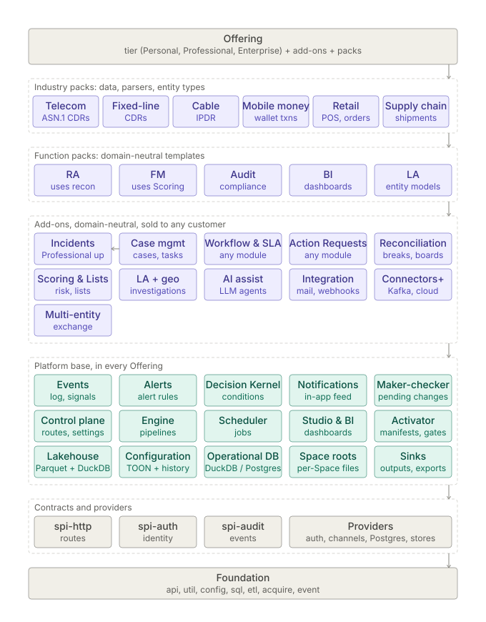

# Module architecture reorganisation — plan (2026-10-06, revised the same day)

> 🟢 **PLAN — analysis only, nothing built; ALL decisions D-MR1…D-MR12 taken (operator, 2026-10-06, §8).**
> **Progress 2026-10-06:** P0 ✅ shipped; P2b ✅ per-Space Enabled gate (see §6 *P2b as built*); P1 partly (governable kinds ✅, `features{}` + SPA nav gating ✅ — see §6 *P1 decision log*). Still open in P1: `OperationalDb.Family` contribution (survey done: `StoreFamily` interface + `StoreFamilyProvider`, update `check-family-count.mjs` and the 15-count tests to core+loaded), contributed OpenAPI fragments, 503 stubs (needs P2 manifests). RBAC capabilities deferred to P2 (P1-D3). Then P2.
> Row to file on approval: `MODULE-REORG-1` (not yet in `BACKLOG.md`).
> Inputs: *Enterprise-Grade Modular Architecture Guidelines* (PDF, 4 pages) and the "System Architecture
> Topology" mock-up (four layers + a per-module inspector). Operator brief: long-term benefit across
> development, test, packaging, offering, editioning and deployment of itemized distribution; **no version
> compatibility, no shims** — change the thing and fix its call sites.
>
> ⚠ **Revision note.** The first draft of this plan mapped the PDF onto the codebase almost literally. The
> operator asked for independent judgement. §1 records where the guidelines fall short for Inspecto and where
> the first draft followed them blindly; §2–§8 are rewritten on that basis. The measured findings (§3) stand.

## 1. Where the guidelines fall short here — and what to do instead

| # | The guidelines say | Why that is not enough for Inspecto | Instead |
|---|---|---|---|
| 1 | Three module kinds: SPI, Platform Service, Feature | One list mixes three independent questions: *is it a contract or an implementation?* (build), *does a customer buy it?* (offering), *when is it bound?* (build, boot, Space, Run). A Provider and a Feature are both implementations; "Product stack" is a grouping, not a kind | Classify every module on **three axes** (§2.1). The first draft's six-kind flat list repeated the PDF's mistake |
| 2 | The Feature module is the unit of sale | A customer buys a **capability**, which spans a backend module, a UI feature, Providers, Platform Service grants, docs — and **content**: Space templates, pipeline packs, dashboards, Alert / Decision Rule sets. For an assurance product much of the value *is* content (`templates/`, `spaces/`, `packs-dev/`, Space bundles). The guidelines never itemize content | An **Offering** is a separate descriptor that composes modules **and** content packs (§2.3). Code modules are never the commercial unit |
| 3 | SPI artifacts contain zero logic | Moving `SpiSlot` (the fail-closed loader), `Roles` parsing or `ErrorCodes` out of the contract into a "kernel" does not remove a dependency — every implementer then needs the kernel too. Purity by LOC is the wrong measure | Contracts may hold logic that *is part of the contract's meaning* (validation of its own DTOs, default methods, the fail-closed loader). Contracts hold **no I/O, no state, no third-party dependency**. Judge a contract by *stability and direction* (who depends on it, how often it changes), not by its line count. The first draft's "logic in contracts → 0" measure is withdrawn |
| 4 | Itemize by module | Every module boundary costs build time, test setup and wiring. 35-line modules (`metrics`) add cost and no option | Draw a module boundary **only** when the code (a) is shipped optionally, (b) carries a distinct **third-party footprint** (size, CVE exposure, licence, export control — e.g. `connectors` bundles `sshj`, `commons-net`, `kafka-clients` and `postgresql` in one jar), (c) is swappable, or (d) needs isolation for test speed. Otherwise use packages with an enforced package rule. Fold or split modules by these four tests, not by taxonomy |
| 5 | Editions are static compositions; SPIs decide infra compatibility | Edition is one dimension of several: **capability tier × add-ons × deployment profile (air-gapped, cloud, demo) × identity mode × scale (single node vs HA lease)**. Inspecto already leaks one into another: maker-checker cannot exist on Personal because Personal has no authenticator — a *deployment* fact surfacing as an *edition* gap | Model profiles as **orthogonal** axes. Availability is the result of **requirement resolution**: a Feature declares it requires an identity contract; whether one is bound decides availability, with no hand-written edition matrix (§2.2) |
| 6 | Features call `entitlementService.assertAuthorized(tenant, feature)` | Licence checks scattered through feature code are a smell and drift. The guidelines also conflate licensing with authorisation. Inspecto's unit of tenancy is the **Space**, not a tenant | Three distinct gates at the edges, never inside feature logic: **Installed** (the jar is present and its requirements resolve) → **Enabled** (switched on for this Space) → **Permitted** (RBAC capability for this user). Features contain no licence code |
| 7 | Declare everything in the manifest | Declared flags drift from reality. Inspecto already has the better pattern: `/bootstrap`'s `features{}` is computed from `hasRoute(...)`, "never an edition guess" | The manifest declares **requirements and contributions**; **availability is computed from what actually bound**. The first draft proposed declared `featureFlag:` / `nav:` lists — that would have reintroduced drift and is withdrawn |
| 8 | Consumer-driven contract tests (Pact), schema-per-module migrations, OCI images | Built for networked microservices. Inspecto is one process; its persisted state is TOON config, per-Space stores and DuckDB/OperationalDb families | In-process **TCKs** for contracts with two or more implementers; a **platform test kit** so a Feature is tested without booting the processor; **storage-family ownership** per module instead of schema-per-module |
| 9 | (silent) | **Removing an item** is the hard part of itemized deployment: a Space config that references a node type, a Job Type or a Decision Rule consequence from a removed module; data in a store family nobody owns any more; a backup restored into an install that lacks the module. Inspecto has been bitten here (a rebuild-from-modeled-state write silently dropped every key it did not model; a stale jar hid behind the palette's silent fallback) | Define **removal semantics** (§2.5): config naming an absent capability loads **inert with a diagnostic**, is never rewritten or dropped; every store family has an owning module; backup and restore carry families of absent modules opaquely |
| 10 | (silent) | The real coupling that stops itemization in this codebase is not module purity — it is **closed central registries** that every feature must edit (§3.2) | **Open every closed registry into a contribution point** before moving any code. This is the highest-value step and the first draft did not name it |

Kept from the guidelines: one-way dependency, a Platform that never imports a Feature, Features testable
against stubs, editions as compositions, a manifest per module, TCKs, and inert-until-activated modules.
Dropped (operator brief and fit): SemVer ranges and a version BOM — replaced by a **single build-id stamp**
(every jar of an install must carry the same build id, checked at boot); adapter bridges; OCI/service-mesh
topologies; a licence engine (D-MR3).

⛔ **Vocabulary.** The PDF's "Platform Services" means horizontal modules; in this repo **Platform Service**
already means the grantable engine facility a Job or pack requests with `requires:`, and **capability** means
RBAC. The new layer is called **Platform module**; `docs/GLOSSARY.md` gets the axes, the three gates and
**Offering** in the same change as P0.

## 2. Target model

### 2.1 Three axes per module

| Axis | Values | Decides |
|---|---|---|
| **Build role** | Foundation · Contract · Platform module · Implementation | what it may depend on |
| **Offering role** | Base (always present) · Optional (part of an Offering) · Provider (chosen by deployment profile) · Internal | whether it can be absent |
| **Binding time** | Build (classpath) · Boot (activator) · Space (enabled per Space) · Run (Platform Service grant, Job Pack) | how it is switched on |

Examples: `inspecto-security` = Implementation · Provider · Boot. `inspecto-ops` = Implementation ·
Optional · Boot + Space. `inspecto-engine` = Platform module · Base · Build. A Job Pack = Implementation ·
Optional · Run.

### 2.2 Requirement resolution, not edition tables
Each manifest says what the module **provides** (contracts it implements, capabilities, routes, config kinds,
store families) and what it **requires** (contracts, other modules). At boot the activator resolves the graph:
an unsatisfied module stays inert and is reported by name with the missing requirement. Edition, add-ons and
deployment profile only decide *which jars are present*; what is available follows. Maker-checker then
becomes available wherever an identity contract is bound, with no edition rule written anywhere.

### 2.3 Offering = composition of modules and content
`offerings/<id>.toon` names modules, UI features, content packs (Space templates, pipeline packs, dashboards,
Alert / Decision Rule sets) and default Space settings. An edition is an Offering that lists other Offerings.
The bundle generator, the EDITIONS matrix and the SBOM are generated from Offerings.

### 2.4 Three gates
**Installed** (jar present, requirements resolved, build id matches) → **Enabled** (per Space; default
from the Offering) → **Permitted** (RBAC). `/bootstrap` reports all three; the SPA reads them instead of its
three hard-coded nav id sets.

### 2.5 Removal semantics
- Config that references an absent capability **loads inert**, is shown with a diagnostic naming the missing
  module, and is never rewritten, normalised away or dropped by a save.
- Each store family declares its owning module; an absent owner leaves the data untouched and unread.
- Backup, restore and Space bundles carry families and config of absent modules opaquely.
- The existing 503-for-absent-route behaviour stays, but stubs are **synthesised** from the manifests of
  modules that are known but not installed.

## 3. Findings — the codebase today

Counts were measured by read-only subagents over `git ls-files` unless marked ✔ (re-checked by me).

### 3.1 Structure

| Topic | Today |
|---|---|
| Split packages ✔ | **7**: `com.gamma.control` across **4** modules (processor 121 files, auth-spi 24, http-spi 5, entity-store 2); `entitylist`, `event`, `acquire`, `intelligence`, `pipeline.exec`, `service`. They block per-module **signed jars** (a package split across jars with different signers fails at class load), not only JPMS |
| Contract modules | ~5.7k of ~6.2k LOC in `audit/auth/http-spi` is concrete. Per §1 #3 that is acceptable where it is the contract's own semantics (`SpiSlot`, DTO validation) and not acceptable where it is policy or state (`AccessPolicies`, `EgressPolicy`, `AuditTrail`, `InMemoryEventStore`) |
| Feature code in Platform | `inspecto-engine` (63k LOC) holds ~15k LOC of feature code (`query` 5.0k, `notify` 3.5k, `alert` 2.0k, `objects` 1.5k, `catalog` 1.8k, `risk` 0.9k) plus feature Job types inside `job`. The processor holds ~25 feature route files (~7–9k LOC). `inspecto-entity-store` imports `com.gamma.control` (lower imports upper) |
| Lower layers | Clean: api, util, config, sql, etl, event, acquire import nothing feature-like |
| Isolation | The five `la-*` modules do not depend on the processor. Of 15 others, all declare it; 7 import none of its classes. `HostContext.service()/.spaces()` return concrete `CollectorService` / `SpaceManager` |
| Extension mechanism | Sound: ~35 `ServiceLoader` contracts, a fail-closed `SpiSlot`, absent routes answer 503, `features{}` computed from bound routes |
| Packaging | One shaded `inspecto.jar` (~94 MB) plus sidecar jars, a `jlink` runtime with a hand-kept module set, the UI dist. Only Job Packs can be added at run time |
| Tests | One TCK (`InvestigationStoreContract`). CI runs one all-modules reactor (`-Pedition-enterprise`); no per-edition assembly test |

`ControlApi` is **not** a god class (1.6k LOC; routes already live in ~70 `RouteModule`s). `policy` →
`ops`/`geo-link` is **test scope only**. ~415 route registrations (grep estimate).

### 3.2 Closed central registries — the real itemization blockers

| Registry | Where | What adding or removing a feature costs |
|---|---|---|
| Built-in route list ✔ | `ControlApi.java:585-596`, a `List.of(...)` | a core edit per feature |
| Absent-module 503 stubs | `Absent*Routes` in `com.gamma.control` (one hand-written class each) | a core class per optional feature |
| Feature flags | `BootstrapRoutes.features()`, one `hasRoute` probe per feature | a core edit |
| SPA nav gating | three hard-coded id sets in `navigation.service.ts` | a UI edit that drifts from the backend |
| RBAC capabilities ✔ | `CapabilityManifest.ENTRIES` (auth-spi) → `Roles.KNOWN_CAPABILITIES` | a contract-module edit per capability |
| Governable config kinds ✔ | `ApprovalPolicy.GOVERNABLE` (processor) | a module's own kind cannot be put under maker-checker |
| API contract ✔ | one `docs/api/openapi-v1.json` | a new route fails the reactor in a module never touched |
| Edition / bundle lists | 4 pom profiles, `tools/bundle-modules.mjs`, two `$modules` strings in `inspecto/package.ps1`, `check-module-deps.mjs`, `docs/EDITIONS.md`, `docs/FEATURE_INVENTORY.md` | 5+ files per module; Preview is a manual union |
| `jlink` module set | `$runtimeModules` in `package.ps1` | a module needing a `jdk.*` module breaks the zip |
| Operational store families | `OperationalDb.Family` (processor) | a new store family is a core edit (§8c) |

✔ **The counter-example to copy:** `EventType` is deliberately open — `Event.type` is a free-form string
and the class holds conventions only, so a module emits a new type without touching it. Every registry above
should work the same way: modules **contribute** entries; the platform validates uniqueness at boot.

## 4. Where every module goes

"Move?" applies §1 #4: code moves only when it is optional, has its own footprint, is swappable, or needs test
isolation.

| Module (today) | Build role · Offering role | Move? |
|---|---|---|
| api, util, config, sql, etl, acquire, event | Foundation · Base | no |
| asn-decoders + engine `Asn1ParserPlugin` | Implementation · Provider (Telecom industry pack, §8a) | **yes** — out of Base, so non-telecom installs do not ship it |
| audit-spi, auth-spi, http-spi | Contract · Base | keep as three; move **policy and state** (`AccessPolicies`, `EgressPolicy`, `AuditTrail`, `InMemoryEventStore`) out; keep `SpiSlot`, DTO validation, `ErrorCodes` |
| engine execution core (`pipeline`, `pipeline.exec`, `consignment`, `inspector`, `enrich`, `parse`, `ingester`, `signal`) | Platform · Base | no |
| engine `job` framework | Platform · Base | split framework from feature Job types **only** for types whose feature is Optional |
| engine `objects` + `ops` object substrate | Implementation · Optional, Professional up (§8a, D-MR11) | **yes** → an **Incidents** module (stores, notes, links, tags, INCIDENT); `Workflow`/`SlaPolicy`/`EscalationRule` → Workflow & SLA; CASE/TASK/Case Rules stay in `ops` = Case Management |
| engine `notify`, `alert`, `query`, `catalog` | Implementation · Base (§8a) | **no** — stay in the engine; enforce package boundaries instead |
| engine `risk` + `RiskScoreJobType` + `RiskScoreRoutes` | Implementation · Optional (§8a add-on) | **yes** → **Scoring & Lists**, with `entity-list` |
| `ReconRunJob` + `ReconRoutes` | Implementation · Optional (§8a add-on) | **yes** → **Reconciliation** |
| `ActionRequests`, `ActionDispatcher`, `ActionRequestRoutes` | Implementation · Optional (§8a add-on) | **yes** → **Action Requests** |
| processor platform half (`control` plumbing, `service`) | Platform · Base | no |
| processor other feature routes | Implementation · Base | register by `ServiceLoader` (P1) — no physical move |
| ops, exchange, entity-list, events, backup, agent, intelligence | Implementation · Optional | keep; trim the processor dependency to narrow interfaces |
| metrics (1 file), events (1 file) | Implementation · Optional, Professional up | **merge** into one Observability module (D-MR5) |
| connectors | Implementation · Provider | **split per third-party footprint** (SFTP/FTP, Kafka, DB export, cloud object stores) |
| security | Implementation · Provider | **split into three** providers now (D-MR6) |
| demo-auth, notify-channels, agent-hosted, policy, la-store-pg | Implementation · Provider | keep; govern |
| la-core, la-api, la-graph, la-storage | Platform + Implementation · Optional | keep as one Link Analysis family |
| geo-link | Implementation · Optional | keep; it adapts six LA ports to platform data |
| inspecto-ui | UI | read the three gates from `/bootstrap` (P2) |

## 5. Design notes

- **Manifest** (TOON, `META-INF/inspecto/module.toon`): `id`, build role, offering role, `provides`
  (contracts, capabilities, routes, config kinds, store families, OpenAPI fragment), `requires`,
  `entitlementKey` (reserved, unused — D-MR3). No declared availability flags.
- **Contribution points** replace §3.2: route modules by `ServiceLoader` only; 503 stubs synthesised from
  manifests of known-but-absent modules; capabilities, governable kinds and OpenAPI fragments contributed per
  module and merged at boot (the OpenAPI document becomes a generated artifact, checked for collisions).
- **Packaging:** thin core jar + one jar per module in `modules/`; the launcher builds the classpath from the
  Offering; per-module SBOM; the `jlink` set derived with `jdeps` from the jars actually shipped; the build-id
  stamp checked at boot. Per-module jars can then be signed — which requires the split packages gone.
- **Test:** a **platform test kit** (real-HTTP control plane over in-memory stores, a fake Space, a fake
  authenticator with two principals for four-eyes) so a Feature's tests do not boot the full processor;
  TCKs for every contract with two or more implementers (`Authenticator`, `TokenRelay`, `RouteModule`,
  `CollectorConnectorFactory`, `NotificationChannel`, `DescriptionProvider`, `MaintenanceTaskProvider`,
  `JobTypeProvider`) and for every contract a third party may implement; per **assembly** tests — each Offering
  boots, `/modules` matches its composition, and each Optional module's absence is tested once (the existing
  absent-parity tests generalised) — no combinatorial edition × feature matrix.
- **Selective test runs:** the manifest graph gives a reliable "which modules does this change affect" answer —
  `codegraph affected` is known broken and must not be used for this.

## 6. Phases — ordered by value to itemization

Each phase ends green: affected tests per change (`-pl <module> -Dtest=A,B`), the full reactor once at phase
end, and every `ci.yml` no-build guard before any push.

| Phase | Scope | Exit measure |
|---|---|---|
| **P0 Vocabulary + baseline** (S) | GLOSSARY: axes, three gates, Offering, Platform module. Report-only guards: split packages, closed registries count, modules per axis, domain vocabulary inside generic engines (§8a). OKF concept `backend/module-taxonomy.md` | baseline numbers recorded |
| **P1 Open the registries** (L) | Route list → `ServiceLoader`; synthesised 503 stubs; contributed capabilities, governable kinds, OpenAPI fragments; `features{}` and SPA gating from bound state | adding an Optional feature touches **only its own module** (proved by adding a sample module in a test) |
| **P2 Manifest + activator + three gates + regroup** (L) | regroup directories and artifactIds by kind (D-MR2); `module.toon` everywhere; requirement resolution; `GET /modules` (the mock-up's topology view, fed by the live graph); per-Space Enabled; build-id stamp | an unsatisfied module is inert and named; Personal reports maker-checker as "requires identity" |
| **P3 Packaging** (M/L) | thin jars, Offering-driven launcher classpath and bundle, `jdeps`-derived `jlink` set, per-module SBOM; split `connectors` by footprint; fix the 7 split packages | one edition source of truth; per-Offering boot test in CI |
| **P4 Removal semantics** (M) | inert config with diagnostics, store-family ownership, opaque backup/restore of absent families | removing a module and re-adding it loses nothing (tested) |
| **P5 Test kit + TCKs** (M) | platform test kit; TCKs listed in §5; drop the processor dependency from the 7 modules that import none of it | a Feature's test suite runs without `inspecto-processor` |
| **P6 Offerings with content** (M) | `offerings/*.toon` composing tier + add-ons + function packs + industry packs (§8a); EDITIONS / FEATURE_INVENTORY generated | a pack is an itemized, installable unit; a template that `requires` two packs installs only where both are present |
| **P7 Selective code moves** (M, was L–XL) | Per §8a only: `Workflow`, `SlaPolicy`, `EscalationRule`, the business calendar and the SLA sweep → a **Workflow & SLA** module behind a governed-item contract; `ActionRequests`, `ActionDispatcher`, `ActionRequestRoutes` → an **Action Requests** module behind a linked-subject contract; the object substrate (engine `objects` + the `ops` stores, notes, links, tags, `ObjectRoutes`) and INCIDENT → an **Incidents** module; CASE/TASK/Case Rules stay in `ops` as **Case Management**; `risk` + its Job Type + routes → **Scoring & Lists** (with `entity-list`); recon Job + routes → **Reconciliation**; `asn-decoders` + `Asn1ParserPlugin` → Telecom industry pack; `metrics` + `events` → one Observability module (D-MR5); `inspecto-security` → three providers (D-MR6); the nine rule kinds onto the Decision Kernel after the spike (D-MR12); split `connectors` into a core and premium connector packs; contract modules shed policy/state. `alert`, `notify`, `query`, `catalog` stay | each move justified by a §1 #4 test |

The approval-SPI extraction (archived 2026-10-06 as superseded: `archived-documents/plans-archive/approval-spi-extraction-plan.md`) folds into P1: governable kinds become a
contribution point, which is what that plan's D-AS3 asked for.

### P6a as built (2026-10-06 — Offerings as a checked artifact; additive, the build is NOT re-plumbed)
- `offerings/{personal,professional,enterprise,preview}.toon` at the repo root: the four editions as the profiles and
  `bundle-modules.mjs` have them today. Professional `includes` Personal, Enterprise includes Professional, Preview
  includes Enterprise (verified subset-shaped: Preview's set is byte-identical to Enterprise's, as EDITIONS says).
  Each lists `modules` (manifest ids), `addons` (built = names modules that exist today; planned = `hostedBy` where the
  code lives until its P7 move), `contentPacks` (the six `spaces/_templates/*` the bundle ships in every edition;
  `packs-dev/*` are dev-only and not shipped) and an empty `defaultSpaceSettings` placeholder.
- `tools/check-offerings.mjs` (+ `.test.mjs`, 15 cases) fails on: a module id with no manifest; an Offering whose module
  set differs from `bundleModules(edition)` or from the edition pom profile (profile = bundle set minus the default-reactor
  modules); a `requires.modules` edge leaving the Offering; a built add-on naming a missing or not-included module; a
  missing content pack; an unknown include or a cycle. **Always-present rule (documented at the top of the script):**
  decided on manifest `offeringRole`, not `buildRole` — `base`/`internal` modules (only `processor` is staged) are never
  listed and are ignored on both sides; `connectors` is `provider` and ships everywhere, so Personal lists it.
  Printed as one line in `check-module-architecture.mjs`'s report. **Follow-up: wire into `ci.yml`** (not done here).
- **Finding — `docs/EDITIONS.md` Packaging row is stale** against the profiles: Professional "NINE optional modules, 12
  staged jars" vs the real 14 optional modules (Personal 2 + 14 = 16 first-party jars, +`postgresql.jar`); the row omits
  `entity-list`, `la-graph`, `la-storage`, `la-core`, `la-api`; Enterprise "10 modules, 13 staged jars" vs 19 first-party
  (adds `policy`, `la-store-pg`, `intelligence`). `pom.xml` `edition-standard` is a legacy alias of Professional.
- **What generating EDITIONS / FEATURE_INVENTORY would need (not done, per instruction):** per-edition module and jar
  counts from the Offering closure (already derivable here); the non-module matrix rows (transport, AuthN, secrets,
  compliance) have no home in an Offering yet — they need a `posture{}` section; capability rows need each manifest's
  `provides.features` plus capability ids (P1-D3, not yet in `provides`); the add-on `status` field is what separates
  "shipped" from "planned" in a generated table. `defaultSpaceSettings` stays `{}` until a real default is decided.

## 6-A. P0 baseline (recorded 2026-10-06, `node tools/check-module-architecture.mjs`)

✅ P0 shipped: GLOSSARY §15, OKF `backend/module-taxonomy.md`, the report-only guard (not wired into CI).
Baseline: **7** split packages · **10** closed registries (built-in route list 59, `Absent*` stubs 6, `hasRoute`
probes 6, SPA nav ids 9, capabilities 216, `OperationalDb.Family` 8, `jlink` set 13, `openapi` paths 423) ·
35 modules with main Java · telecom words in generic code: engine 51, alert 4, query 4, la-api 2, la-graph 3
(possibly similarity `sim`), la-core/storage/store-pg 0 → "LA for other domains" looks like content, not code.
P1 survey: the built-in route list is at `ControlApi` `:590-604`; optional modules already load via
`OptionalSpi.all(RouteModule.class)`; registration is first-match so the built-in order is load-bearing — step 1
needs an `order()` on `RouteModule` and a golden registration-order test.

### P1 decision log
- **P1-D1 (2026-10-06): the built-in route list stays an explicit list.** Optional modules already load through
  `OptionalSpi.all(RouteModule.class)` and are appended after the built-ins, so "an Optional feature touches only
  its own module" already holds for *routes*. Moving the ~58 core built-ins (mostly package-private classes, in a
  first-match order that is load-bearing) to `ServiceLoader` would cost making them public and buy no itemization.
  The remaining route-side blocker is the hand-written `Absent*Routes` stubs, which needs the P2 manifests (the
  surface of an absent module must be known from somewhere that is present). P1 therefore targets the other
  registries first: capabilities, governable kinds, `OperationalDb.Family`, `features{}` and SPA nav gating.
- **P1-D2 (2026-10-06): governable kinds opened first** — `GovernableKindProvider` (`inspecto-http-spi`), the processor
  unions fail-soft providers; `inspecto-entity-list` contributes `entity-list`. An absent module's kind is not
  governable (a policy naming it is refused 422).
- **P1-D3 (2026-10-06): RBAC capability contribution DEFERRED to P2.** Only 8 of 216 capabilities are exclusive to
  an optional module (4 `exchange`, 4 `la-api`); moving them drags `Roles.CAN_*` constants, `SEED` grants and the
  literal-only scanner guards (`CapabilityManifestTest`, `route-gating-report`, authgate) — guard edits that need the
  operator — and makes the role vocabulary depend on the classpath. It lands with the P2 manifest, where `provides`
  names the capabilities and the scanner can be made per-module. Recipe: `CapabilityContributor` SPI in `auth-spi`,
  contributors use string literals only (class-init cycle `Roles → CapabilityManifest → contributor → Roles`).
- **P1-D4 (2026-10-06): `features{}` / SPA gating** — `RouteModule.featureIds()` default, collected only after a
  successful `register()`; five legacy keys kept; SPA `navFeature` replaces the three id sets.

### P2a as built (2026-10-06 — manifest, activator, `GET /modules`; the directory regroup is NOT done)
- `inspecto-util` `com.gamma.module`: `ModuleManifest`, `ModuleManifests.load(ClassLoader)` (fail-soft per file; enum
  fields and duplicate ids validated), `ModuleActivator.resolve` (fixpoint from all-active; reasons name each unmet
  module or contract). `module.toon` is in all 34 modules with `src/main/java` (33 under `inspecto*` plus
  `asn-decoders` in the nested `asn-facade`); roles follow §4. `GET /modules` = `ModulesRoutes`, appended LAST in
  `ControlApi`'s list, read-only, no capability, one generated skeleton in `openapi-v1.json`.
- **P2a-D1: `provides.features` is checked against the code, not trusted** — `ModuleManifestGuardTest` fails when a
  module with main Java has no manifest, or its features differ from the strings in its `featureIds()`; it also
  resolves the whole source tree and demands every module ACTIVE. `check-module-architecture.mjs` prints
  *modules without manifest* (0).
- **P2a-D2: `requires.modules` only for real runtime Maven edges** — la-core→la-graph, la-storage→la-core,
  la-api→la-core+la-storage, la-store-pg→la-core, geo-link→la-api+la-core, entity-list→entity-store,
  agent-hosted→agent. `exchange`→`ops` and `policy`→`ops`/`geo-link` are test scope, so NOT declared. The host
  (`processor`) is implicit and never listed. `provides.contracts` lists the SPIs a module implements
  (its `META-INF/services` files).
- **Gotcha — `geoLink` is provided by `la-api`, not `geo-link`:** `GeoRoutes`/`InvRoutes` (which declare it) live in
  `inspecto-la-api`; `geo-link` only adapts ports. The manifest follows the code.
- **Gotcha — shaded jars collapse same-named resources.** All 34 files share one path, so the processor's shade got
  an `AppendingTransformer` for it; each file therefore starts with a `---` line and the loader splits on that
  line. A **sidecar** shade (`agent`, `connectors`) has no such transformer and is not on the host's class path.
  Verified 2026-10-06: the `-Pedition-enterprise` fat jar's merged resource holds 14 manifests (the processor's dependency closure; optional modules ship as separate jars).
- **Gotcha — TOON:** empty sections are simply omitted from the files; the loader still tolerates `{}` for an empty
  key and `[0]:` arrays. A `#` line is data, not a comment (JToon) — never put one in a manifest.
- **Build-id stamp: SKIPPED.** Only the shaded processor jar carries `Implementation-Version` (HOME-VERSION-1);
  module jars are unstamped, so a per-jar boot check has nothing to compare. It needs a P3 packaging change first.
- Deferred to later P2 steps: directory/artifactId regroup (D-MR2), per-Space Enabled gate, capabilities in
  `provides` (P1-D3), 503 stubs synthesised from manifests, `/bootstrap` reading the three gates.
- `route-gating.md` was already stale from the P1 `featureIds()` line shifts; it was regenerated with this change.

### P2b as built (2026-10-06 — the per-Space Enabled gate, D-MR10)
- **Document:** `modules.toon` = `disabled: [feature ids]` in the Space config root (absent = all enabled, so a newly
  installed module defaults to enabled). `ModuleSettings` (read cache keyed by mtime+size, atomic write) holds the TOON
  I/O; `ModuleSettingsRoutes` = `GET|PUT /settings/modules` (sibling of `/settings/egress`; `canAdminister`, audit
  action `module-settings.changed` as an `AUDIT` event, no new EventType). Reserved from import (`ReservedConfigPaths`).
- **Validation:** an id must be in `registeredFeatures()` (an installed module's `featureIds()`), otherwise 422 — that
  also covers core feature names such as `authoring`. Stored ids that no installed module declares are **inert**: listed
  in `inert`, disable nothing, and are re-added by every save, as are unmodelled keys of the file (tested).
- **Enforcement:** `ControlApi` stamps each route a discovered module registered with that module's feature ids (the new
  `Route.features`, taken from the route-table slice around `register()`); `requireModuleEnabled` runs after
  authenticate + authorize (a refused caller learns nothing) and before idempotency/handler, in `routeDispatch` and in
  `replay`. Answer: **404 `MODULE_DISABLED`** (new `ErrorCodes` constant) vs the 503 `CAPABILITY_UNAVAILABLE` of a module
  that is not installed. Core routes and absent-module stubs own no feature, so `/bootstrap`, `/modules` and
  `/settings/modules` can never be disabled. `ApiContext.disabledFeatures()` (default empty) exposes the current Space's set.
- **Reads:** `/bootstrap` `features{}` = registered AND not disabled (the five legacy keys, plus every other installed
  feature id under its own key); `GET /modules` gains `enabledInSpace` (per request; the manifest load stays cached).
- **Deviation (decided here):** a `modules.toon` that cannot be parsed reads as *nothing disabled* with a warning and
  `unreadable: true` on the GET, and a PUT over it is refused 422 (a save would drop what it holds). Not fail-closed
  like `approvers.toon`: this gate narrows the product surface only; the Permitted gate (capabilities) is untouched.
- **Gotchas:** `ConfigWriteFunnelTest` scans a route file for `JToon.encode`, so the TOON write lives in
  `ModuleSettings`, not the route class (the settings-record pattern; no `NO_SAVE_GATE` row needed). The module
  test class path carries no optional module, so the tests switch off `TestDiscoveredRoutes` (feature `testDiscovered`).
  `OpenApiPathsContractTest -Dopenapi.paths.write=true` also reformats three unrelated hand-edited lines; they were
  restored. The error-code enum in `openapi-v1.json` is hand-kept: `MODULE_DISABLED` added.
- **Open:** `ImportLoaderInventoryTest.everyFixedNameALoaderReadsIsReservedOrAllowedWithAReason` is RED since P2a
  (`META-INF/inspecto/module.toon` read by `ModuleManifests.java`): it needs an `ALLOWED` row with a reason (a classpath
  resource an import cannot plant) — a guard-inventory edit that needs the operator.
- **Deferred:** a settings screen (SPA) for `/settings/modules`; the SPA still reads `/bootstrap` only. A disabled
  module's background Jobs and stores are NOT stopped (the gate is on the HTTP surface; P4 owns removal semantics).

### P5a as built (2026-10-06 — platform test kit + RouteModule TCK; the processor dependency is NOT yet dropped)
- **Kit home:** the **test-jar of `inspecto-http-spi`** (`src/test/java/com/gamma/control/testkit`), not a new module (§1 #4).
  Consumers declare `inspecto-http-spi` `type test-jar`, scope test (managed in the root pom). `FakeApiContext` is the one
  in-repo `ApiContext` double (`ControlApi` is the only other implementation): it records `(method, pattern, withCapability
  capability, stub)` per route, answers `hasRoute` (stubs excluded, like the host), `registeredFeatures`/`disabledFeatures`
  defaults, `writeRoot`/`dataRoot`, `body`, and `dispatch(method, concretePath, body[, Subject])` runs a handler in-memory — with a
  `Subject`, `withCapability` enforces exactly as the host does. `replay` throws (needs the real dispatcher).
  `PortHarness` (la-api) was migrated onto it (it is now ~30 lines of delegation; `LaApiPortsTest` unchanged, 6/6).
- **TCK:** abstract `RouteModuleContract` (`module()` + optional `exemptMutatingRoutes()` = key `METHOD pattern` to reason). Five
  tests: registers at least one route; no duplicate `(method, pattern)`; every POST/PUT/PATCH/DELETE is behind `withCapability` or
  exempt (a stale exemption fails too, so the list cannot rot); `featureIds()` within the module's OWN `module.toon`
  `provides.features` (located by loading only the class's code-source through an isolated class loader, so the other modules'
  manifests on the class path are invisible); two fresh registrations yield the same routes. Exemption reasons mirror
  `CapabilityManifest.EXEMPTIONS`.
- **Driven without booting the processor (8 classes, 5 modules, 40 tests):** `EntityListRoutes`, `EventRoutes`, `MetricsRoutes`,
  `ObjectRoutes`, `NoteRoutes`, `TagRoutes` (ops), `GeoRoutes`, `InvRoutes` (la-api). Note: these modules still have
  `inspecto-processor` on their compile class path; what changed is that a route test no longer needs `ControlApi`/a Space.
- **Cannot yet be driven — `ExchangeRoutes`:** `register()` itself calls `HostContext.of(api).spaces()` (to install
  `SharedRefResolver`, the signal forwarder and two fence hooks), so any `ApiContext` that is not the host's `HostContext` throws
  `IllegalState`. Blocker for dropping its processor dependency: those installs belong in a boot hook that receives the Space
  registry, not in `register()`. Not mocked on purpose. Not attempted: the remaining la-api route classes (many take host-free
  ports and could subclass the TCK next), `inspecto-geo-link` and `inspecto-policy`.
- **Still open for P5:** the TCKs of §5 other than RouteModule; the "drop the processor dependency from the 7 modules" step.

## 7. Success measures (baseline → target)

| Measure | Today | Target |
|---|---|---|
| Files outside its own module touched to add an Optional feature | 5+ core/UI/build files | 0 |
| Closed central registries (§3.2) | 10 | 0 |
| Hand-maintained edition/module lists | 5+ | 1 (Offerings) |
| Split packages | 7 | 0 |
| Per-Offering boot tests | 0 | one each |
| Contracts with ≥2 implementers covered by a TCK | 1 | all |
| Features whose tests need the full processor | 15 | only those using host internals |
| Config referencing an absent module that survives a save unchanged | untested | tested, 100 % |

## 8. Decisions — all taken (operator, 2026-10-06)

| # | Question | Decision |
|---|---|---|
| D-MR1 | Contract modules | **Keep three** (`audit-spi`, `auth-spi`, `http-spi`); move policy and state out (`AccessPolicies`, `EgressPolicy`, `AuditTrail`, `InMemoryEventStore`); contract-semantics logic (`SpiSlot`, DTO validation, `ErrorCodes`) stays |
| D-MR2 | Rename / regroup directories by kind | **Yes, once, in P2** (operator chose this over the recommendation to defer): directories `spi/ platform/ features/ providers/ la/` with aggregator poms, artifactIds by kind, done together with the manifests so docs, citations and guards are rewritten once |
| D-MR3 | Licence / entitlement engine | **None**; Installed / Enabled / Permitted gate everything; `entitlementKey` reserved in the manifest |
| D-MR4 | Manifest | **TOON at `META-INF/inspecto/module.toon`** |
| D-MR5 | `metrics` and `events` (one file each) | **Merge into one Observability module**, included from Professional up (CP-13 unchanged) |
| D-MR6 | Split `inspecto-security` | **Yes, now** (operator chose this over "on demand"): three providers — OIDC authenticator + token relay, secrets provider, geo-country resolver |
| D-MR7 | JPMS | **No**; the split-package guard and signed per-module jars give the boundary |
| D-MR8 | Thin per-module jars | **Yes** (P3) |
| D-MR9 | What is sold separately | **The offering map in §8a** |
| D-MR10 | Per-Space enablement | **Yes** (P2) |
| D-MR11 | Where Incidents sit | **Its own add-on, from Professional up**; EDG-01 cell 7 and OPS-02 stand |
| D-MR12 | One Decision Kernel for the nine rule kinds | **Yes, spike first** (§8b): the Consequence registry lands in P1; the Condition Language is adopted kind by kind in P7 after the spike |

## 8a. D-MR9 — the offering map (✅ decided, operator 2026-10-06)

**Test for "separately saleable"** — all five must hold, otherwise the capability is Base:
1. **A distinct buyer or budget** recognises it (a persona or team that asks for it by name).
2. **The base stays coherent without it** — no core workflow is left with a dead end.
3. **Separable at reasonable cost** — already a module, or a clean seam (§3).
4. **Its absence breaks no security or compliance promise.**
5. **It carries its own cost or risk** — third-party libraries, an LLM, a database, outbound egress — which is
   what makes pricing it separately fair.

### Base — every Offering, never removed
Ingest, Collectors (file/SFTP), parsing, Pipelines, Consignments, schema and Catalog, Expectations, **Alerts**,
in-app notifications, **Studio** (Datasets, Queries, Widgets, Dashboards), Jobs and scheduling, Decision Rules,
Spaces, the audit log, the maker-checker hold, and the condition evaluation that the rule kinds share (§8b).

**Alerts and Incidents are two separate modules (operator, 2026-10-06), and Incidents does not need Case
Management.** Alerts are base. **Incidents is an add-on included from Professional up** (D-MR11, decided). The
chain is Events/Signals → **Alerts** (Alert Rules evaluate) → **Incidents** (an Alert promoted, through the
`IncidentAccess` Platform Service, when the Incidents add-on is installed) → *optional* **Cases and Tasks** (Case
Management add-on). Personal keeps its recorded posture (EDG-01 cell 7): Alerts, no operational objects. An
install with Incidents but without Case Management still raises and works Incidents.
Today one object model carries all four: `ObjectType { ALERT, INCIDENT, CASE, TASK }` (engine `objects`), with
the object, note, link and tag stores, `ObjectService` and `ObjectRoutes` in `inspecto-ops`. The split: the
**Incidents** module takes that shared object substrate (stores, notes, links, tags, `ObjectRoutes`) and the
INCIDENT type; **Case Management** keeps CASE and TASK plus `CaseRule` / `CaseRuleEvalJob`. ⚠ To verify before P7:
whether ALERT objects are written to that store today (then Alerts depend on the substrate too) and how far
`ObjectService` already separates the types.

Why not sell Alerts, notifications or Studio separately: they fail test 2 — without them a data-assurance
platform cannot show or flag anything, and every edition already ships them (EDITIONS CP-08, CP-12; the SPA
deliberately does not gate Alerts). Moving `alert`, `notify`, `query` or `catalog` out of the engine would cost
an XL move for no offering value.

### Add-ons — horizontal, sold to any customer

| Add-on | Modules | Why it passes the test |
|---|---|---|
| **Incidents** (D-MR11, operator 2026-10-06) | the object substrate (engine `objects` + the `ops` object, note, link and tag stores, `ObjectRoutes`) and the INCIDENT type | included in every Offering from **Professional up**; never Personal (EDG-01 cell 7 stands). Carries the Enterprise "Postgres mandatory" rule for operational objects (OPS-02) |
| **Case Management** | `ops` remainder: Cases, Tasks, Case Rules (`CaseRule`, `CaseRuleEvalJob`) | the assurance operations team; already optional (CP-11). Requires **Incidents** and **Workflow & SLA**; offers **Action Requests** from Cases when that add-on is present |
| **Reconciliation** (operator, 2026-10-06) | `ReconRunJob`, `ReconRoutes`, recon boards, break sets (CP-10) | domain-neutral: revenue in telecom; stock, orders and shipments in retail and supply chain. The RA function pack requires it |
| **Scoring & Lists** (operator, 2026-10-06) | engine `risk` (`RiskScoreModel`, `RiskScorer`, `RiskScoreEvaluator`), `RiskScoreJobType`, `RiskScoreRoutes`, `entity-list` (Entity Lists, watch-list feed) | domain-neutral: entity types are already free-form. The FM function pack requires it; credit, churn or supplier-risk packs could too |
| **Action Requests** (operator, 2026-10-06) | four-eyes approved outbound calls: create → approve/decline → dispatch with bounded retries under one idempotency key, the `approverCheck`, the Decision Rule `invoke-api` consequence — **raisable from any module** | today `ActionRequests`, `ActionDispatcher`, `ActionRequestRoutes` sit in the processor, link only to an Incident or Case (`inspecto-ops`), and send through `inspecto-notify-channels` (CP-16). The add-on links to anything that implements a small **linked-subject contract** (id, visibility check for the approver's data scope, a place to show the answers): Incidents and Cases first, then e.g. reconciliation breaks, Link Analysis investigations, Entity List entries. It **requires Integration & Delivery** for the wire (egress allowlist, pinned connect) and uses the base approver roster and four-eyes rules, which stay base because the Pending Change hold needs them too |
| **Workflow & SLA** (operator, 2026-10-06) | authored Workflows (states, transitions), SLA policies with a business calendar, escalation — **usable by any module**, not only Case Management | today the models are dependency-free (`Workflow` 325 LOC, `SlaPolicy` 179, `EscalationRule` 100 in engine `objects`) but only `ops` applies them, keyed by its own object types. The add-on applies them to anything that implements a small **governed-item contract** (state, priority, owner, timestamps, allowed transitions): Incidents and Cases first, then e.g. reconciliation breaks, Entity List reviews, Link Analysis investigations. `inspecto-agent`'s own `EscalationPolicy` **stays separate** (operator re-decision 2026-10-06, after the spike showed it is an LLM retry ladder, not an escalation rule); it gets its own canonical name in P0. Base features (the maker-checker expiry, Action Request expiry) keep their simple built-in expiry and never depend on the add-on |
| **Link Analysis & Investigations** | `la-*`, `geo-link`, the `la-app` UI | the fraud investigator; already optional (CP-09) and already ships as its own UI application — the strongest standalone candidate, possibly a product of its own |
| **AI Assist & Intelligence** | `agent`, `agent-hosted`, `intelligence` | LLM cost and data-egress risk; air-gapped customers must be able to omit it (CP-14) |
| **Integration & Delivery** | `notify-channels`, the `publish.postgres` BI publication Job, outbound webhooks | outbound egress is a security decision; needs the Postgres driver (CP-15, JOB-06) |
| **Premium Connectors** | `connectors` split: Kafka, cloud object stores, DB export | distinct third-party footprint (`kafka-clients`, `postgresql`…); file/SFTP stays Base |
| **Multi-entity / Group** | `exchange` + per-Space isolation | only meaningful with several Spaces — the group/regulator federation proposal (SEC-06, SEC-10) |

### Solution packs — per domain, mostly content
Each pack = **Space Templates** (Pipelines, Expectations, Alert and Decision Rule sets, Dashboards, thresholds as
configuration) that **requires** add-ons; a pack carries its own code only when no domain-neutral add-on can
express its computation. Content is where most domain value sits (assurance plan §1: "content packs ship as Space
Templates").

| Pack | Requires | Content |
|---|---|---|
| **Revenue Assurance** | Reconciliation | RA Space Templates |
| **Fraud Management** | Scoring & Lists (pairs with Link Analysis) | FM Space Templates |
| **Business Assurance / payment fraud** | — | Space Templates only |

### Tiers — deployment and compliance posture, not features
**Personal** (single user, no IAM), **Professional** (IAM, HTTPS, RBAC, Postgres, backup, `/metrics`, events
feed), **Enterprise** (ABAC, enforced Space isolation, shared stores, HA, certifications). Backup, metrics and
the events feed belong to the tier — operational posture is not sold item by item.

### More solution packs will follow (operator, 2026-10-06)
Named so far by the operator: **compliance Audit**, **BI for other domains**, **LA for other domains**, and new
verticals — **mobile money**, **fixed-line**, **cable / IPDR-based analytics**, and beyond telecom **retail** and
**supply chain** (named in the operator's reply when asked what "Fx" in the first note meant).

**Two kinds of pack, composed — not one pack per vertical × function.** With five functions (RA, FM, Compliance
Audit, BI, LA) and six-plus verticals, one pack per pair would mean thirty packs that copy each other. Instead:

| Pack kind | Holds | Examples |
|---|---|---|
| **Function pack** — domain-neutral | generic Space Templates written against neutral entity and measure names, requiring the add-ons it uses | Revenue Assurance (→ Reconciliation), Fraud Management (→ Scoring & Lists), Compliance Audit, BI, Link Analysis |
| **Industry pack** — the vertical's data | record formats and parsers, Collector connectors, entity types, link kinds, reference data, the mapping from the vertical's fields to the function packs' neutral names | Telecom mobile (ASN.1 CDRs), fixed-line, cable / IPDR, mobile money, retail, supply chain |

A sellable solution such as *"Mobile money fraud"* is then an **Offering** = Fraud Management function pack +
Mobile money industry pack + a thin layer of Space Templates that `requires` both. The manifest's `requires`
(§2.2) is what makes this composition safe: a template installs only where both packs are present.

Consequence for §4: `asn-decoders` and the engine's `Asn1ParserPlugin` / `parser.asn1.ber` catalog entry stop
being Base and become a **Provider in the Telecom industry pack** — a retail or supply-chain install should not
ship an ASN.1 telecom decoder. An IPDR collector or parser, when built, lands in the cable industry pack the same
way.

**Domain-neutrality, first measurement (2026-10-06, grep for telecom terms in generic modules — preliminary):**
almost every hit is an event-bus "subscriber", a code comment or an example in a message. Real telecom coupling
found so far: the ASN.1 parser in the core processor catalog; `RiskScoreModel.ENTITY_TYPES`
(`subscriber, account, device, sim, dealer, channel, partner`), which is a telecom-flavoured suggestion list but
**accepts any other token**, so not a blocker; and examples such as `MSISDN` in messages. Link Analysis reads its
entity types from configuration (`EntityTypes`, `LinkAnalysisSettings` in `inspecto-entity-store`), so "LA for
other domains" looks like a content job, not a code job — to be confirmed by P0's check.

Three design requirements follow, and they are binding on P1–P6:
1. **A new solution pack needs zero platform edits.** It ships as Space Templates, plus at most one domain module
   and one UI feature, and installs as an Offering item. P1's exit measure (an Optional feature touches only its
   own module) applies to packs too.
2. **Generic engines stay domain-neutral.** Studio/BI, Link Analysis, Expectations, Alerts, Decision Rules and the
   audit log carry no domain vocabulary in code; entity types, link kinds, measures, thresholds and labels come
   from the pack's configuration. "LA for other domains" and "BI for other domains" depend on this.
   ⚠ Not yet verified for Link Analysis: whether telecom-specific entity or link types are hard-coded in
   `la-core` / `la-api` / `geo-link` or come from configuration. P0 adds a domain-neutrality check (report-only)
   and the answer decides whether LA needs work before a second LA pack.
3. **A domain module is the exception, not the rule.** A pack gets code only when its domain needs a computation
   no domain-neutral add-on can express; Reconciliation and Scoring & Lists were promoted to add-ons for exactly
   that reason, so today no pack needs code of its own.

### What this changes in the plan
- P7 moves only: Workflow & SLA, Action Requests, Incidents (object substrate) and Case Management apart;
  `risk` + `entity-list` → Scoring & Lists; recon → Reconciliation; the ASN.1 parser → Telecom industry pack;
  the `connectors` split. `alert`, `notify`, `query`, `catalog` stay in the engine.

## 8c. Storage and state — the base layer the first drafts left implicit

Raised by the operator (2026-10-06): the plan read as if the platform had no database. It has **no single
database and no ORM**, but it does have a storage layer with three kinds of state (as built:
[`okf/backend/engine/db-layer.md`](../okf/backend/engine/db-layer.md) §1):

| Kind of state | What | Where and how | Today's code |
|---|---|---|---|
| **Business data** | ingested records | Hive-partitioned Parquet/CSV under the Space's data directory, queried through DuckDB (`read_parquet` / `read_csv`); DuckLake registration | `SqlViews`, `DatasetRelation`, `DuckDbRecordSink`, `DuckLakeRegistrar`, the Sinks |
| **Configuration** | authored Components, Pipelines, Views, Connections, settings | TOON files under the Space's `registry/`, versioned in `.history/`, written atomically | `ComponentStore`, `AtomicFiles`, `ConfigSafetyValidator`, the path jail |
| **Operational data** | facts about the system's own operation: job runs, ingest status, provenance, Consignment outputs, file stages, dedup and acquisition ledgers, run lease, delivery receipts, operational objects | one DuckDB file per family by default, **Postgres** via `-Dinspecto.db=postgres` (driver as the `postgresql.jar` sidecar); events append-only in Parquet | `OperationalDb` (+ its `Family` roster), `ServiceStores`, `JdbcDrivers`, `DbRunLease`, `ParquetEventStore` |

Everything is **per Space** (`SpaceRoot` resolves the file topology), and backup / restore (tier, Professional
up) carries all three.

**Where it sits in the target model:** a **Storage** row in the Platform base — Lakehouse (business data),
Configuration, Operational DB, Space roots, Sinks — with the backends as **Providers**: the Postgres driver
sidecar, the Postgres Investigation store (`la-store-pg`), and later a shared object store (OPS-05).

**What the reorganisation changes in it:**
1. 🔴 **A tenth closed registry: `OperationalDb.Family`.** The roster of operational-store families is one enum
   in the processor, and optional modules (`inspecto-ops`) open their stores through it so there is "ONE place
   that decides how an operational DB is addressed". Under §1 #10 it becomes a contribution point: a module's
   manifest declares the families it owns (name, default backend, Postgres schema); the platform still owns
   *how* a family is addressed and selected. Lands in P1.
2. **Store-family ownership** is the hook for removal semantics (P4): an absent module's families stay on disk,
   unread, and travel through backup and restore.
3. **Storage contracts stay with their capabilities** (`ObjectStore`, `StatusStore`, `InvestigationStoreProvider`
   …); no central storage SPI module is added (consistent with D-MR1). Each such contract with two or more
   implementations gets a TCK (P5) — `InvestigationStoreContract` is the existing model.

## 8b. Rule evaluation — consolidate, do not add an engine (D-MR12, OPEN)

**Question (operator, 2026-10-06): don't we need a rule engine?** The platform already has nine rule kinds, each
with its own evaluator, measured 2026-10-06:

| Kind | Where | LOC | Evaluates over |
|---|---|---|---|
| Alert Rule | engine `alert/AlertRule` (+ `AlertService`) | 532 | Datasets (set-based) |
| Decision Rule | engine `pipeline/DecisionRules`, `query/DecisionRuleApplier`, `query/RuleTemplate` | 97 + 309 + 163 | Datasets (set-based) |
| Expectation | processor `expectation` | ~850 | Datasets (set-based) |
| Risk factors | engine `risk` | ~880 | Datasets (set-based) |
| Notification Rule | engine `notify/NotificationRule` | 120 | one event (in memory) |
| Tag Rule | `ops/tag/TagRule` | 151 | one object (in memory) |
| Case Rule | `ops/tag/CaseRule` | 91 | one object (in memory) |
| Escalation Rule | engine `objects/EscalationRule` | 100 | one object over time |
| Access Policy | auth-spi `AccessPolicies` + `inspecto-policy` | 349 + 195 | one request (in memory) |

**A shared condition language already exists and is barely used.** `inspecto-util`'s `Conditions` was built for
"one policy engine, many policy kinds" (RBAC/ABAC plan §4 A2, 2026-07-23): a small closed grammar
(`and`/`or`/`not`, `==`, `!=`, `in`, `contains`) parsed into a predicate over a context map, and its own header
names Tag Rules and Notification Rules as intended adopters. Today **only Access Policies use it**.

**Recommendation — no general-purpose rule engine** (a Drools-style engine is a large dependency, a second
language for authors, and a poor fit for set-based rules that must run inside DuckDB). Instead, one base
capability with three parts:
1. **One condition language** — `Conditions` — adopted by every in-memory kind (Notification, Tag, Case,
   Escalation, Access). For the set-based kinds (Alert, Decision, Expectation, risk), the same grammar compiles to
   a SQL predicate checked by `SqlGuard`, so authors learn one syntax. ⚠ Needs a spike: whether the set-based kinds'
   current expressions fit the grammar or need it extended.
2. **One trigger → condition → consequence model** — *when* (event, signal, schedule, object change) / *if*
   (conditions) / *then* (consequences) — shared by the kinds instead of nine bespoke shapes. Each kind keeps its
   canonical name and authoring surface (one word → one concept).
3. **An open consequence registry** — modules contribute consequences, like every other §3.2 registry: base
   contributes *notify* and *tag*; Incidents contributes *open Incident*; Case Management *open Case*; Action
   Requests *invoke-api*; Workflow & SLA *escalate*. A consequence whose module is absent is reported unavailable
   by the activator, never silently skipped (today `invoke-api` reports *skipped* on Personal).

Lands in P1 (the consequence registry is a contribution point) and P7 (adopting the shared grammar kind by
kind).

**Canonical names (picked 2026-10-06, confirmed by the operator the same day; enter `docs/GLOSSARY.md` in P0).** The glossary already binds the two
outer terms, so nothing is coined for them: a **Decision Engine** is "anything that turns conditions/signals into
Consequences" (each rule kind is one), and a **Consequence** is the typed action it produces. New names cover only
the shared machinery:
- **Decision Kernel** — the base capability every Decision Engine runs on: the Condition Language, the
  when / if / then model and the Consequence registry. A Decision Engine is a *kind* (Alert Rule, Tag Rule…); the
  Decision Kernel is the one runtime they share. ⛔ Not "rule engine" (bare Rule is banned) and not "policy engine"
  (Policy is taken by Access, Approval and SLA policies).
- **Condition Language** — the **condition tree** (`ConditionTree` / `ConditionSql` / `query-eval.ts`), with
  `Conditions` as a text notation that parses into it (✅ confirmed by the operator after the spike, 2026-10-06).
- **Consequence registry** — the open contribution point for Consequences (an existing term plus "registry").
⚠ `inspecto-agent` has a package `agent.kernel` — a code name, not a glossary term; note the shared word where
the two meet.

### Decision Kernel spike — specification (D-MR12, runs before P7 adoption)

**Goal:** prove or refute that one Condition Language serves all nine Decision Engines, in memory and compiled to
SQL, before any kind is migrated. Time-box: one lane, read-mostly; code only in a throwaway worktree.

**Questions to answer, each with evidence:**
1. **Coverage.** For each kind, list every condition form its authored configs use today (committed TOON under
   `spaces/` and `templates/`, plus test fixtures): comparisons, ranges, `in`, regex/like, null checks, time
   windows, aggregates, joins. Which forms does `Conditions` lack?
2. **SQL compilation.** Can each `Conditions` construct compile to a DuckDB predicate that `SqlGuard` accepts, with
   identifiers bound to declared Dataset columns only (no free SQL)? Prove on Alert Rule and Decision Rule
   fixtures: same rows selected before and after.
3. **Set-based extras.** Alert Rules and risk factors use aggregates and windows. Do those belong in the condition
   (grammar grows) or stay in the kind's own shape around a condition (grammar stays small)? Recommend one.
4. **Trigger model.** Map each kind's current trigger (event, signal, schedule, object change, request) onto one
   when / if / then shape; list kinds that do not fit.
5. **Consequences.** List every Consequence each kind can produce today against the glossary's Consequence list;
   name the module that would contribute each to the Consequence registry.
6. **Cost.** Per kind: LOC removed, LOC added, authoring-surface change for users, and migration of existing
   configs (no compatibility shims — configs are rewritten).

**Exit:** a short report appended here with a per-kind verdict (*adopt as is* / *adopt after grammar extension
X* / *stays bespoke because Y*), the grammar extensions accepted, and the P7 adoption order. ⛔ The spike changes
no shipped behaviour; any prototype lives in a worktree under `.claude/worktrees/` and is deleted after.

### Decision Kernel spike — report (2026-10-06, read-only; three parallel investigations)

**🔴 The premise was wrong: the platform has TWO condition languages, and the richer one is not `Conditions`.**

| | `Conditions` (`inspecto-util`, 282 LOC) | Condition tree (`ConditionTree` 249 + `ConditionSql` 194, engine `query`; UI twin `query-eval.ts`) |
|---|---|---|
| Form | text expression | JSON tree `{kind: group, op: AND\|OR, items: [{kind: condition, field, operator, value, value2}]}` |
| Operators | `==` `!=` `in` `contains`, `and` `or` `not` | `= != < <= > >=`, `between`, `in`, `contains`, `startsWith`, `endsWith`, `isNull`, `isNotNull`; groups AND/OR; **no `not`** |
| Backends | in memory only | in memory **and** DuckDB SQL |
| Users today | Access Policies only | Alert Rule `when`, Decision Rule `when`, Expectation `condition`, the SPA's query builder |
| Compares | field to field (`resource.space != subject.space`) | field to literal only |

So the **Condition Language should be the condition tree**, not `Conditions`: it already has both backends, the
operators most kinds need, a UI builder, and three of the nine kinds. `Conditions` becomes a **text notation that
parses into the same tree** (kept for Access Policies), once the tree gains what it lacks. The canonical name
stands; its referent changes (✅ confirmed, operator 2026-10-06).

**Tree extensions the kinds need:** `not` (negated group); field-to-field operand; a case-insensitive flag on
string operators; `matches` (regex, for Expectations); derived context fields supplied by each kind's context
builder (`ageMinutes`, `levelRank`, a normalised status). One semantic to settle: the tree treats `''` as null in
`isNull`, `Conditions` does not.

**Per-kind verdict**

| Kind | Verdict | Stays bespoke |
|---|---|---|
| Decision Rule | **on the tree already** | — |
| Alert Rule | `when` on the tree already | metric / measure, threshold, window, `by` group-by, freshness — the kind's own shape around a condition |
| Expectation | `condition` on the tree; `non_null` and `range` map to `isNull` / `between`; `regex` after `matches` | `referential` (subquery) and `baseline` (profile comparison) |
| Risk factor | `filters` move to the tree | aggregate, key, weight, cap |
| Tag Rule | filter → tree (needs case-insensitive flag) | status alias fold → done by the context builder |
| Case Rule | filter → tree (same as Tag Rule) | count-within-window grouping |
| Notification Rule | → tree (needs `levelRank`, case-insensitive) | — |
| Escalation Rule | match → tree (needs `ageMinutes`, breach flag) | fire-once ledger, sweep |
| Access Policy | keep the `Conditions` text, compiled into the tree once `not` and field-to-field exist | — |

**What it saves, honestly:** little code (~50 LOC of single-item matchers, plus one of the two duplicate
evaluators). The value is one authoring surface and builder for every kind, one place to lint references, and the
Consequence registry — not deleted code.

**Two findings outside the question:**
- 🔴 **Decision Rules build `DELETE` / `UPDATE` / `CREATE TABLE AS` / `COPY` on the in-flight table by string
  concatenation of `ConditionSql` output, guarded by escaping only — no `SqlGuard`, no bound parameters**
  (`DecisionRuleApplier.java:185-276`). Not shown to be exploitable here; recorded for the security review before
  the kernel makes this path the shared one — ✅ filed as `DECISION-RULE-SQL-GUARD-1` (BACKLOG §3.8).
- ⚠ **The agent's `EscalationPolicy` is not an escalation rule.** It is an LLM retry ladder (`BumpModelTier` →
  `HumanHandoff(queue)` → `Abstain`), procedural and synchronous; only its confidence threshold is a condition. The
  2026-10-06 decision to fold it into Workflow & SLA rested on a false premise — ✅ **re-decided the same day: it
  stays in the agent, under its own canonical name.**

**P7 adoption order:** (1) Expectation `non_null` / `range` onto the tree; (2) tree extensions (`not`,
field-to-field, case-insensitive, `matches`); (3) Tag and Case Rule filters; (4) Notification Rules; (5) Risk
filters; (6) Escalation match; (7) Access Policies' `Conditions` text compiled into the tree (last:
security-sensitive); then retire the duplicate evaluator.

### Target picture

- Offerings (P6) become: one tier + any add-ons + any solution packs.
- ⚠ Commercial judgement is the operator's: this map applies the five tests to what the code and the edition
  matrix show; it does not rest on market or pricing data.

## 9. Risks and traps (from this repo's own history)

- 🔴 **A guard that goes vacuous** — e.g. `ConfigWriteFunnelTest` finds holds with the regex
  `PendingChanges\.hold\w*\(`; a rename makes it match nothing and pass. Every moved symbol needs the guards
  that grep for it re-pointed and proved red by hand (the auto-mode classifier refuses an agent editing a guard
  to prove it red — queue the mutations for the operator).
- 🔴 **A green full reactor is not green CI** — route-gating, `openapi-v1.json`, authgate coverage and the
  `guards` job fire only in the reactor or CI. Run every `ci.yml` no-build guard before a push.
- 🔴 **Packaging runtime** — a module needing a `jdk.*` module broke every ingest in the zip once; prove each
  Offering on `runtime/bin/java`, not the build JVM.
- 🔴 **Silent loss on save** — a rebuild-from-modeled-state write dropped every key it did not model. P4 must
  test that config naming an absent module survives a save byte-for-byte in meaning.
- 🔴 **Stale sibling jar** — `-pl` without `-am` tests a stale jar of a moved module; never `-Dtest=A+B`.
- ⚠ **Shared checkout** — each phase in a worktree under `.claude/worktrees/` (never `%TEMP%`); merge, never
  overwrite, `SESSION_STATUS.local.md`.
- ⚠ **The `job` package** imports every feature package (73 imports of `pipeline`, 30 of `signal`, 23 of
  `consignment`, 16 of `query`, 15 of `notify`) — touch it only for Job types whose feature is Optional.

## 10. Not verified

Re-checked by me: the split packages, the hard-coded route list, `EventType` being open, `CapabilityManifest`
entries feeding `Roles.KNOWN_CAPABILITIES`, `ApprovalPolicy.GOVERNABLE`, the single `openapi-v1.json`, and
`connectors`' third-party dependencies. Subagent-measured and not re-derived: module and package LOC, the
feature Job type LOC inside `job` (estimate), ~415 route registrations (grep estimate), the UI mapping (from
service and nav names), the bundle sizes. Still to read before P1: `docs/EDITIONS.md` and
`docs/FEATURE_INVENTORY.md` in full, which store families exist per module, and how Space bundles treat
unknown config kinds today.
